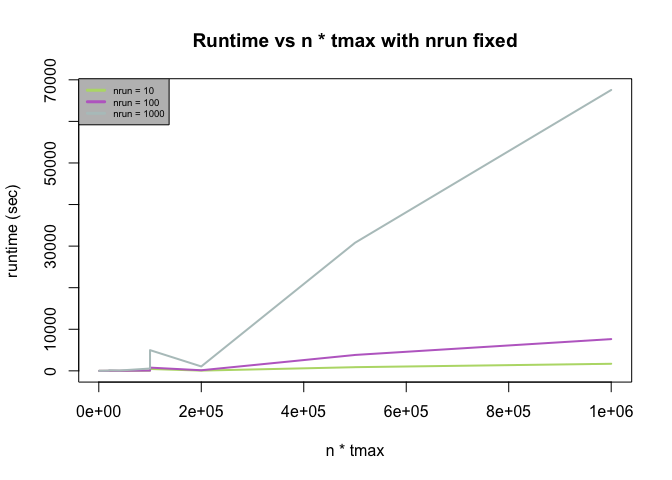
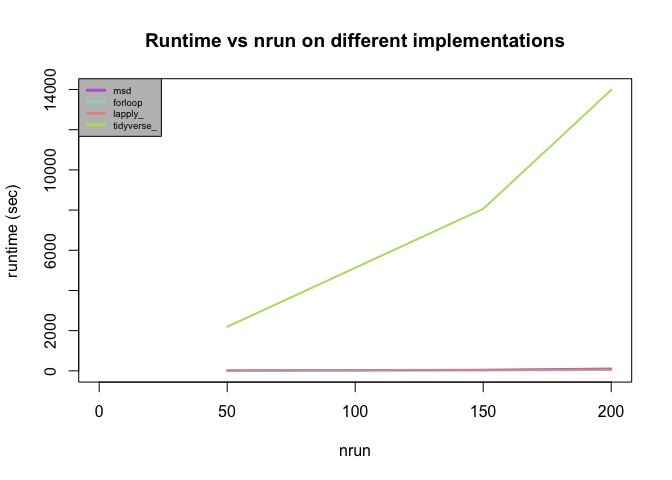

PFSI Simulation Scaling Factors and Data Cleaning Tools
================
Zhanhao Zhang
9/5/2019

## Introduction

In this markdown, we will explore different factors that may constrain
on the scalability of pfsi simulation (n, tmax, nrun). In addition, we
need a way to combine simulated results from all trials of experiments
together into a single dataframe to make statistical reference without
blowing up memory. This file will also show two ways for getting the
combined dataframe, as long with several ways of their implementations.

In the last section, the markdown provides a function that can be used
to extract mean and standard deviations for each data point of simulated
pfsi.

## Execution

The experiments of the effects of n, tmax and nrun on the runtime of
pfsi simulation, and the experiments of the runtime for different ways
of combining data (calculate mean and standard deviation on the fly,
for-loop, lapply, and tidyverse) take significant amount of time and
memory. The code chunks of these experiments are included below but will
not be executed when you knit this markdown file. The results from these
experiments are saved as CSV files in the data folder, which can be
directly extracted to visualize the results. However, if you do want to
execute the code chunks for these experiments, then the suggested
qlogin/qsub commands to get them running smoothly on IHME’s clusters is
below:

``` bash
qlogin -l m_mem_free=200G,fthread=51 -q long.q -P ihme_general -hard -l archive=TRUE -l h_rt=48:00:00
```

## Libraries

## Factors Constraining Scalability of Simulation

Factors that can impact the scalability of simulation are mostly the
following three:  
n: number of patches.  
tmax: maximum time step for the simulation.  
nrun: number of trials to simulate.  
Below will show the results from timing experiments of varying these 3
factors, which give you a sense on how these 3 factors can affect the
runtime of simulation.

``` r
simulation_timing <- function(n = 8, tmax = 1e2, nrun = 1e1){
  ###
  # simulation_time() allows you to adjust the number of each factor
  # that may impact the scalability of the simulation, and return 
  # the runtime of the simulation. Notice that the runtime is not recorded
  # for the processes that setup the parameters. The runtime is only recorded
  # for the period of simulations.
  #
  # Inputs:
  #   n: number of patches. DEFAULT = 8.
  #   tmax: maximum time step for the simulation. DEFAULT = 100.
  #   nrun: number of trials to simulate. DEFAULT = 10.
  #
  # Outputs:
  #   runtime of the simulation.
  #
  # Notice:
  #   the number of people in each patch is turned down from 1000 to 100
  #   in order to save time.
  ###
  
  path <- here("data/output/")
  if(!dir.exists(path)){
    dir.create(path)
  } else {
    files <- list.files(path)
    if(length(files) > 0){
      for(f in files){
        file.remove(paste0(path,f))
      }
    }
  }
  
  # vector of parameters
  pfsi_pars <- pfsi_parameters()
  #### set up patches (n is how many patches we have)
  ###n <- 200
  # movement matrix for humans is uniform over possible destinations.
  move <- matrix(data = 1/(n-1),nrow = n,ncol = n)
  diag(move) <- 0
  patch_pars <- patches_parameters(move = move,bWeightZoo = rep(0,n),bWeightZootox = rep(0,n),reservoir = rep(F,n),res_EIR = rep(0,n))
  # mosquitos
  psi <- Matrix::sparseMatrix(i = {},j = {},x = 0.0,dims = c(n,n))
  diag(psi) <- rep(1,n)
  mosy_pars <- mosquito_rm_conpars(N = n,lambda = matrix(50,nrow = 365,ncol = n),
                                   psi = psi,EIP = rep(11,365),M = rep(450,n),Y = rep(0,n),Z = rep(0,n))
  
  # humans
  patch_sizes <- rep(1e2,n) # number of people in each patch
  pfpr <- rep(0.5,n) # malaria prevalence in each patch
  nh <- sum(patch_sizes) # total num of humans
  # sample S or I for each person
  init_state <- unlist(mapply(FUN = function(n,pr){
    sample(x = c("I","S"),size = n,replace = T,prob = c(pr,1-pr))
  },n=patch_sizes,pr=pfpr,SIMPLIFY = F))
  # where the people go (0-indexed for c++)
  patch_id <- rep(0:(n-1),times=patch_sizes)
  # uniform biting weights; this could follow any density on the positive reals (gamma, log-normal, weibull, etc.)
  bweights <- rep(1,nh)
  # the data structure that will be passed down to C++ to construct the human pop
  human_pars <- vector("list",nh)
  for(i in 1:nh){
    human_pars[[i]] <- human_pfsi_conpars(id = i-1,home_patch_id = patch_id[i],
                                          trip_duration = rep(3,n),trip_frequency = 1/20,bweight = bweights[i],
                                          age = 20,state = init_state[i],bite_algorithm = 0)
  }
  # vaccinations (can uncomment the code below to vaccinate 25% of the population at day 500)
  # vaxx_pars <- list()
  vaxx_id <- sample(x = 0:(nh-1),size = nh*0.25,replace = F)
  vaxx_pars <- lapply(X = vaxx_id,FUN = function(id){
    vaccination_pfsi_conpars(id = id,t = 5e2,treat = T,type = "PE")
  })
  
  log_pars <- list()
  h_inf <- paste0(path,"pfsi.csv")
  log_pars[[1]] <- list(outfile = h_inf,key = "pfsi",
                        header = paste0(c("time","patch",unlist(lapply(c("S","I","P"),function(x){paste0(x,c("_visitor","_resident_home","_resident_away"))})),"incidence_resident","incidence_traveller"),collapse = ",")
  )
  mosy <- paste0(path,"mosy.csv")
  log_pars[[2]] <- list(outfile = mosy,key = "mosquito",
                        header = paste0(c("time","state",paste0("patch",1:n)),collapse = ","))
  
  
  ### Run Patches
  
  ###nrun <- 1e2
  tsteps <- tmax
  pb <- txtProgressBar(min = 1,max = nrun)
  t1 <- Sys.time()
  
  var_foreach <- foreach(i = 1:nrun, .packages = "macro.pfsi") %dopar% {
    log_pars <- list()
    h_inf <- paste0(path,"pfsi_",i,".csv")
    log_pars[[1]] <- list(outfile = h_inf,key = "pfsi",
                          header = paste0(c("time","patch",unlist(lapply(c("S","I","P"),function(x){paste0(x,c("_visitor","_resident_home","_resident_away"))})),"incidence_resident","incidence_traveller"),collapse = ","))
    mosy <- paste0(path,"mosy_",i,".csv")
    log_pars[[2]] <- list(outfile = mosy,key = "mosquito",
                          header = paste0(c("time","state",paste0("patch",1:n)),collapse = ","))
    
    run_macro(tmax = tsteps,
              human_pars = human_pars,
              mosquito_pars = mosy_pars,
              patch_pars = patch_pars,
              model_pars = pfsi_pars,
              log_streams = log_pars,
              vaxx_events = vaxx_pars,
              verbose = FALSE)
    setTxtProgressBar(pb,i)
    
    NULL
  }
  
  t2 <- Sys.time()
  return(t2 - t1)
}

### Here starts the timing experiments

## Warm up the CPU. Results will NOT be recorded.
for(i in 1:5){
  simulation_timing()
}

## begin the real experiments
df_timing_results <- c()
all_n <- c(8, 40, 200, 1000)##c(8, 16, 24)##
all_tmax <- c(100, 500, 1000)##c(50, 100, 200)##
all_nrun <- c(10, 100, 1000)##c(10, 20, 30)##
for(n in all_n){
  for(tmax in all_tmax){
    for(nrun in all_nrun){
      runtime <- simulation_timing(n = n, tmax = tmax, nrun = nrun)
      runtime <- as.numeric(runtime, units = "secs")
      df_timing_results <- data.frame(
        rbind(data.frame(df_timing_results),
              data.frame(n = n, tmax = tmax, nrun = nrun, runtime = runtime)))
    }
  }
}
```

Visualize the effects of n, tmax, and nrun on the runtime of simulation

``` r
## Visualize the runtime results
df_timing_results <- read.csv(here("data/output/df_timing_results.csv"))
all_n <- sort(unique(df_timing_results$n))
all_tmax <- sort(unique(df_timing_results$tmax))
all_nrun <- sort(unique(df_timing_results$nrun))
knitr::kable(df_timing_results, caption = "(runtimes are in seconds)")
```

|    n | tmax | nrun |      runtime |
| ---: | ---: | ---: | -----------: |
|    8 |  100 |   10 | 5.393364e-01 |
|    8 |  100 |  100 | 1.896172e+00 |
|    8 |  100 | 1000 | 6.864640e+00 |
|    8 |  500 |   10 | 6.809959e-01 |
|    8 |  500 |  100 | 1.203509e+00 |
|    8 |  500 | 1000 | 6.676037e+00 |
|    8 | 1000 |   10 | 8.137865e-01 |
|    8 | 1000 |  100 | 1.616174e+00 |
|    8 | 1000 | 1000 | 1.019931e+01 |
|   40 |  100 |   10 | 2.379530e+00 |
|   40 |  100 |  100 | 2.915283e+00 |
|   40 |  100 | 1000 | 1.077063e+01 |
|   40 |  500 |   10 | 3.936122e+00 |
|   40 |  500 |  100 | 6.452756e+00 |
|   40 |  500 | 1000 | 4.245167e+01 |
|   40 | 1000 |   10 | 4.021954e+00 |
|   40 | 1000 |  100 | 9.824144e+00 |
|   40 | 1000 | 1000 | 8.116009e+01 |
|  200 |  100 |   10 | 1.979467e+01 |
|  200 |  100 |  100 | 3.494129e+01 |
|  200 |  100 | 1000 | 1.367349e+02 |
|  200 |  500 |   10 | 4.476673e+01 |
|  200 |  500 |  100 | 7.364066e+01 |
|  200 |  500 | 1000 | 5.580584e+02 |
|  200 | 1000 |   10 | 5.702809e+01 |
|  200 | 1000 |  100 | 1.438169e+02 |
|  200 | 1000 | 1000 | 1.058390e+03 |
| 1000 |  100 |   10 | 4.471895e+02 |
| 1000 |  100 |  100 | 7.763052e+02 |
| 1000 |  100 | 1000 | 4.982804e+03 |
| 1000 |  500 |   10 | 8.840434e+02 |
| 1000 |  500 |  100 | 3.824020e+03 |
| 1000 |  500 | 1000 | 3.079863e+04 |
| 1000 | 1000 |   10 | 1.710123e+03 |
| 1000 | 1000 |  100 | 7.639939e+03 |
| 1000 | 1000 | 1000 | 6.755984e+04 |

(runtimes are in
seconds)

``` r
plot(NULL, main = "Runtime vs n * tmax with nrun fixed", xlab = "n * tmax",
     ylab = "runtime (sec)", xlim = c(min(all_n) * min(all_tmax), 
                                max(all_n) * max(all_tmax)),
     ylim = c(0, max(df_timing_results$runtime)))
colors = distinctColorPalette(length(all_nrun))
for (i in 1:length(all_nrun)) {
  dat <- df_timing_results[df_timing_results$nrun == all_nrun[i],]
  dat <- dat[order(dat$n * dat$tmax),]
  lines(dat$n * dat$tmax, dat$runtime, lwd = 2, col = colors[i])
}
legend("topleft", paste("nrun =", all_nrun), col = colors,
       bg = "gray", cex = 0.6, lwd = 3)
```

<!-- -->

## Methods to implement the combined dataframe

There are several different ways to retrieve the statistical data from
all the simulated results. Adjustments to the combined dataframe can be
made based on the needs.  
If we only need the mean and standard deviation, then we can read only
one file at a time and compute them on the fly, and the final results
will be two dataframes, one containing mean values of each box, while
the other one containing standard deviations. The resulting dataframe
will be of the same size as that of the file for one single trial of
simulation.  
However, if we need information on median or quantiles that require us
to store data from every simulation all together before making the
computation, then we have to construct a much larger dataframe to hold
data points from every simulation. One efficient way is to melt the
dataframe from each output file, extract only one set of columns of keys
(time, patch, and Key in our case), and append values from all output
files horizontally to the combined dataframe.  
To get the combined dataframe with data points from all trials included,
we have three approaches: for-loop, lapply, and map-reduce in tidyverse.
Below will show the timing for each of these
approaches.

``` r
## Record the time it takes to calculate mean and standard deviation on the fly
time_msd <- function(nrun = 10){
  ###
  # time_msd() calculate the runtime it takes to compute the mean and standard
  # deviation of each data points from given number of simulations.
  #
  # Input:
  #   nrun: the number of simulations in total. By specifying nrun, this function 
  #         will compute the mean and standard deviation based on pfsi_1.csv to
  #         pfsi_{nrun}.csv. DEFAULT = 10.
  #
  # Output:
  #   the total execution time of this function in seconds.
  ###
  
  t1 <- Sys.time()
  df_curr <- fread(here("data/output/pfsi_1.csv"), sep = ",", header = T)
  mat_curr <- as.matrix(df_curr)
  mat_mean <- mat_curr[, 3:ncol(mat_curr)]
  mat_sq <- mat_mean**2
  for(i in 2:nrun){
    df_curr <- fread(paste(here("data/output/"), "pfsi_", i, ".csv", sep = ""), 
                     sep = ",", header = T)
    mat_curr <- as.matrix(df_curr)
    df_curr <- data.frame(df_curr)
    mat_curr <- mat_curr[, 3:ncol(mat_curr)]
    mat_mean <- mat_mean + mat_curr
    mat_sq <- mat_sq + mat_curr**2
  }
  mat_mean <- mat_mean / nrun
  mat_sd <- sqrt(mat_sq / nrun - mat_mean**2)
  t2 <- Sys.time()
  return(as.numeric(t2 - t1, units = "secs"))
}

time_forloop <- function(nrun = 10){
  ###
  # time_forloop() calculate the runtime it takes to generate the combined
  # dataframe of experiments' results by iterating over the file list using
  # for loop.
  #
  # Input:
  #   nrun: the number of simulations in total. By specifying nrun, this function 
  #         will generate the combined dataframe based on pfsi_1.csv to
  #         pfsi_{nrun}.csv. DEFAULT = 10.
  #
  # Output:
  #   the total execution time of this function in seconds.
  ###
  
  t1 <- Sys.time()
  df_curr <- fread(paste(here("data/output/"), "pfsi_1", ".csv", sep = ""), 
                     sep = ",", header = T)
  df_curr <- data.frame(df_curr)
  melted_df2 <- melt(df_curr, id.vars = c("time", "patch"))
  for(i in 2:nrun){
    df_curr <- fread(paste(here("data/output/"), "pfsi_", i, ".csv", sep = ""), 
                     sep = ",", header = T)
    df_curr <- data.frame(df_curr)
    melt_curr <- melt(df_curr, id.vars = c("time", "patch"))
    melted_df2 <- cbind(melted_df2, melt_curr$value)
  }
  t2 <- Sys.time()
  return(as.numeric(t2 - t1, units = "secs"))
}

time_lapply <- function(nrun = 10){
  ###
  # time_lapply() calculate the runtime it takes to generate the combined
  # dataframe of experiments' results by iterating over the file list using
  # lapply.
  #
  # Input:
  #   nrun: the number of simulations in total. By specifying nrun, this function 
  #         will generate the combined dataframe based on pfsi_1.csv to
  #         pfsi_{nrun}.csv. DEFAULT = 10.
  #
  # Output:
  #   the total execution time of this function in seconds.
  ###
  
  t1 <- Sys.time()
  df_curr <- fread(paste(here("data/output/"), "pfsi_1", ".csv", sep = ""), 
                     sep = ",", header = T)
  df_curr <- data.frame(df_curr)
  melted_df2 <- melt(df_curr, id.vars = c("time", "patch"))
  flist <- paste0("pfsi_", 2:nrun, ".csv")
  df_tmp <- do.call(cbind, lapply(paste0("output/", flist), function(x){
    df_curr <- fread(paste(here("data/output/"), "pfsi_", i, ".csv", sep = ""), 
                     sep = ",", header = T)
    df_curr <- data.frame(df_curr)
    melt_curr <- melt(df_curr, id.vars = c("time", "patch"))
    melt_curr$value
  }))
  melted_df2 <- cbind(melted_df2, data.frame(df_tmp))
  t2 <- Sys.time()
  return(as.numeric(t2 - t1, units = "secs"))
}

time_tidyverse <- function(nrun = 10){
  ###
  # time_tidyverse() calculate the runtime it takes to generate the combined
  # dataframe of experiments' results by map-reduce on the file list using
  # tidyverse.
  #
  # Input:
  #   nrun: the number of simulations in total. By specifying nrun, this function 
  #         will generate the combined dataframe based on pfsi_1.csv to
  #         pfsi_{nrun}.csv. DEFAULT = 10.
  #
  # Output:
  #   the total execution time of this function in seconds.
  ###
  
  t1 <- Sys.time()
  pfsi_combined <-
    paste0("pfsi_", 1:nrun, ".csv") %>%
    map(~read_csv(paste0(here("data/output/"),.)) %>% 
          gather(Key, Value, -time, -patch)) %>%
    reduce(full_join, by = c("time", "patch", "Key"))
  t2 <- Sys.time()
  return(as.numeric(t2 - t1, units = "secs")) 
}

## Warm Up CPUs
for(i in 1:5){
  time_msd()  
}

## Real Experiments
time_implementations <- c()
for (nrun in all_nrun) {
  msd <- time_msd(nrun)
  forloop <- time_forloop(nrun)
  lapply_ <- time_lapply(nrun)
  tidyverse_ <- time_tidyverse(nrun)
  time_implementations <- data.frame(rbind(data.frame(time_implementations), 
       data.frame(nrun = nrun, msd = msd, forloop = forloop, 
                  lapply_ = lapply_, tidyverse_ = tidyverse_)))
}
```

Visualize the runtime of creating combined dataframe of experiments’
results using different approaches (calculating mean and standard
deviation on the fly, for loop, lapply, and tidyverse)

``` r
## Visualize the results
time_implementations <- read.csv(here("data/output/time_implementations.csv"))
knitr::kable(time_implementations, caption = "(runtimes are in seconds)")
```

| nrun |       msd |  forloop | lapply\_ | tidyverse\_ |
| ---: | --------: | -------: | -------: | ----------: |
|   50 |  21.72788 |  8.88341 | 11.54876 |    2192.024 |
|  150 |  54.51663 | 22.82181 | 33.87619 |    8061.486 |
|  200 | 112.51221 | 43.85797 | 75.85523 |   13978.533 |

(runtimes are in seconds)

``` r
max_time <- max(time_implementations[, 2:5])
colors = distinctColorPalette(ncol(time_implementations) - 1)

plot(NULL, main = "Runtime vs nrun on different implementations", xlab = "nrun",
     ylab = "runtime (sec)", xlim = c(0, max(time_implementations$nrun)),
     ylim = c(0, max_time))
for (i in 1:length(colors)) {
  lines(time_implementations$nrun, time_implementations[, 1 + i],
        col = colors[i], lwd = 2)
}
legend("topleft", colnames(time_implementations)[2:ncol(time_implementations)], 
       col = colors, bg = "gray", cex = 0.6, lwd = 3)
```

<!-- -->

### Script for extracting mean and standard deviation

``` r
get_mean_sd <- function(nrun = 10){
  ###
  # get_mean_sd() computes the mean and standard deviation of each data
  # points based on the simulated experiments
  #
  # Input:
  #   nrun: the number of trials of experiments. DEFAULT = 10
  #
  # Output:
  #   A list storing matrices of mean and standard deviation. The matrices
  #   correspond to the data points of pfsi output files (starting from
  #   the 3rd column to the end)
  #     mean: matrix of mean values
  #     sd: matrix of standard deviations for each data point
  ###
  
  df_curr <- fread(here("data/output/pfsi_1.csv"), sep = ",", header = T)
  mat_curr <- as.matrix(df_curr)
  mat_mean <- mat_curr[, 3:ncol(mat_curr)]
  mat_sq <- mat_mean**2
  for(i in 2:nrun){
    df_curr <- fread(paste(here("data/output/"), "pfsi_", i, ".csv", sep = ""), 
                     sep = ",", header = T)
    mat_curr <- as.matrix(df_curr)
    df_curr <- data.frame(df_curr)
    mat_curr <- mat_curr[, 3:ncol(mat_curr)]
    mat_mean <- mat_mean + mat_curr
    mat_sq <- mat_sq + mat_curr**2
  }
  mat_mean <- mat_mean / nrun
  mat_sd <- sqrt(mat_sq / nrun - mat_mean**2)
  return(list(mean = mat_mean, sd = mat_sd))
}
```
