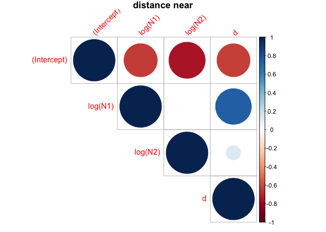
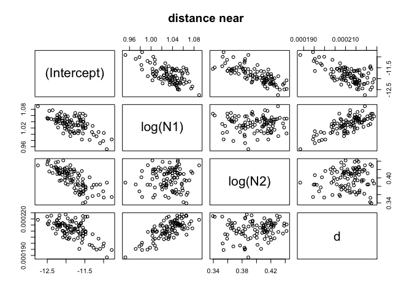
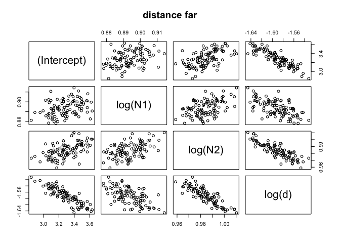
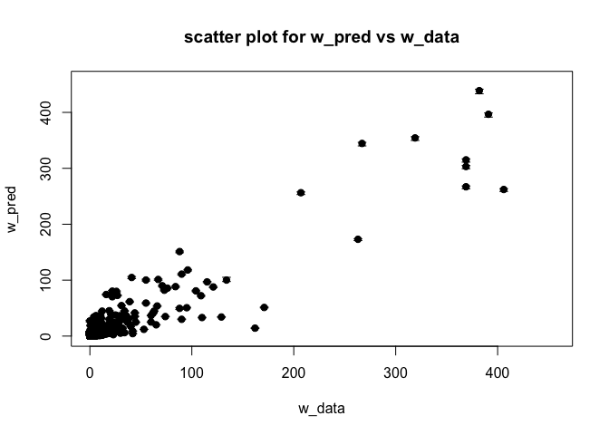
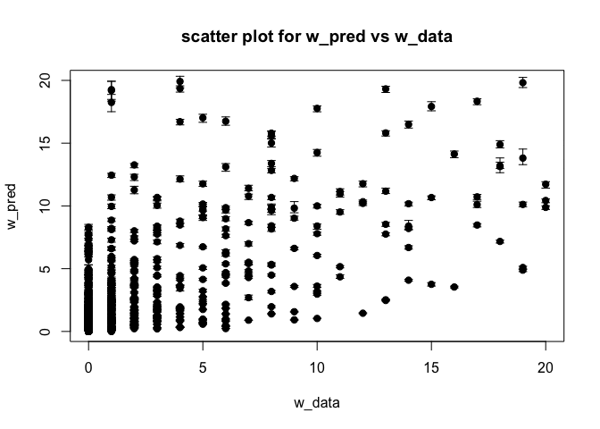
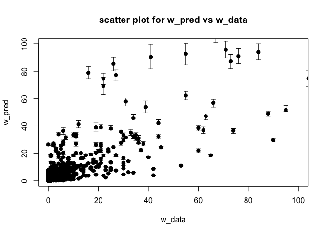
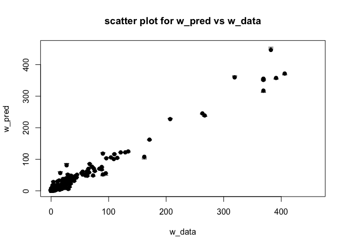
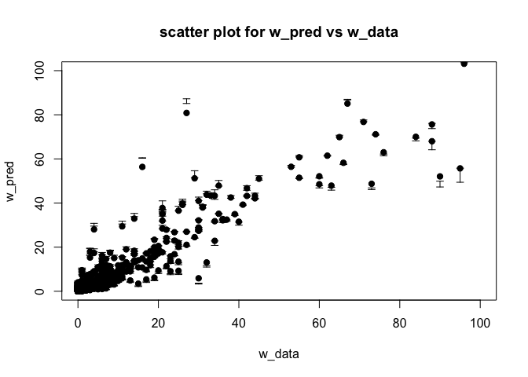
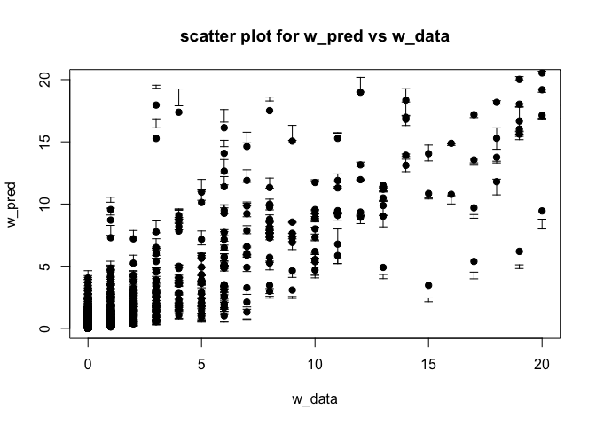

posterior\_gravity
================
Zhanhao Zhang
8/6/2019

## Overview

Now that we have explored several different regression models on the
traveling data in predicting commuting flows between each pair of
regions, we are going to visualize their posterior analysis.

## Packages Needed

``` r
library(doParallel)
library(foreach)
library(doRNG)
library(bigstatsr)
library(MASS)
library(corrplot)
library(ggplot2)

source("../scripts/extract_models.R")
```

## Read the Data

train\_data: pre-cleaned data with covariates for ad2 included, used for
the poisson regression and negative binomial regression.  
rel\_dat\_mul: the pre-cleaned data used to train multinomial regression
model, with each pair of (source, destination) repeated based on the
number of commuting flows between them.  
test\_dat\_mul: the pre-cleaned data used to generate predictions for
multinomial regression model, which is almost the same as rel\_dat\_mul
except that it doesn’t have those
duplicates.

``` r
train_data <- fread("../data/clean/rel_gravity_dat_covs.csv", header = T, sep = ",")
rel_dat_mul <- fread("../data/clean/rel_dat_mul.csv", sep = ",", header = T)
test_dat_mul <- fread("../data/clean/test_dat_mul.csv", sep = ",", header = T)

train_data <- data.frame(train_data)
rel_dat_mul <- data.frame(rel_dat_mul)
test_dat_mul <- data.frame(test_dat_mul)
```

## Helper Functions

``` r
predict_allType <- function(coefs, dat, model_name){
  ###
  # predict_allType() is a function that gives predicted values
  # of a given dataset using the given coefficients and the type
  # of model.
  #
  # Inputs
  #   coefs: coefficients of the model.
  #   dat: the dataset to predict.
  #   model_name: the name of model, valid names include "linreg",
  #               "poisson", "negbin", and "multinom"
  # Output:
  #   the predicted values of the dataset. Return NULL if the inputs
  #   are illegal.
  #
  # Note:
  #   If the requested model is multinomial regression, you should also
  #   make sure that the coefficient matrix passed in is properly named.
  #   I.e. it should follow the same convention as the coefficients
  #   returned by the summary() of a multinom() object.
  ###
  
  # helper function for getting predicted values from linear regression
  predict_lin <- function(coefs, dat){
    coefs <- matrix(coefs, nrow=1)
    pred <- coefs %*% t(dat)
    return(pred)
  }
  
  # helper function for getting predicted values from poisson
  # regression or negative binomial regression
  predict_poi <- function(coefs, dat){
    coefs <- matrix(coefs, nrow=1)
    pred <- coefs %*% t(dat)
    pred <- exp(pred)
    return(pred)
  }
  
  # helper function for getting predicted values from multinomial
  # regression. The predicted values are probabilities.
  predict_mul <- function(coefs, dat){
    rownames <- rownames(coefs)
    coefs <- matrix(coefs, ncol = ncol(coefs))
    init_pred <- coefs %*% t(dat)
    exp_pred <- rbind(rep(1, nrow(dat)), exp(init_pred))
    ones <- matrix(1, nrow = 1, ncol = nrow(exp_pred))
    denom <- ones %*% exp_pred
    exp_pred <- t(exp_pred)
    standardized_pred <- matrix(NA, nrow = nrow(exp_pred),
                                ncol = ncol(exp_pred))
    for(i in 1:ncol(exp_pred)){
      standardized_pred[,i] <- exp_pred[,i] / denom
    }
    
    colnames(standardized_pred) <- c("(Base)", rownames)
    return(standardized_pred)
  } 
  
  # Bind 1 to the beginning of dataset to allow for intercept
  dat <- cbind(rep(1, nrow(dat)), dat)
  dat <- data.matrix(dat)
  
  # predict using different models based on different model_name
  # return NULL if the model_name is illegal
  if(model_name == "linreg"){
    return(predict_lin(coefs, dat))
  } else if(model_name == "poisson" || model_name == "negbin"){
    return(predict_poi(coefs, dat))
  } else if(model_name == "multinom"){
    return(predict_mul(coefs, dat))
  } else{
    print('Usage: predict_allType(coefs, dat, 
          model_name=c("linreg", "poisson", "negbin", "multinom"))')
    return(NULL)
  }
}

sample_coefs <- function(est, sd){
  ###
  # sample_coefs() is a function for sampling a set of coefficient
  # values based on the given coefficient values and their
  # corresponding standard deviations. Assuming the distributions
  # of these coefficient values follow normal distribution N(est, sd)
  # 
  # Inputs:
  #   est: the estimated values for each coefficient.
  #   sd: the standard deviation for each coefficient value.
  #   est, sd are usually obtained from a lm or glm object.
  #
  # Output:
  #   a random sample of coefficient values based on the given
  #   estimated values and their corresponding standard deviations.
  #
  ###
  
  sample <- matrix(NA, nrow = nrow(est), ncol = ncol(est))
  for(i in 1:nrow(est)){
    for(j in 1:ncol(est)){
      sample[i, j] <- rnorm(1, est[i, j], sd[i, j])
    }
  }
  rownames(sample) <- rownames(est)
  colnames(sample) <- colnames(est)
  return(sample)
}

sample_coefs_cor <- function(n, model){
  ###
  # sample_coefs_cor() is a helper function for sampling the
  # coefficients of a model while taking the correlations
  # between each covariate into account. The sampling takes
  # place in a multivariate normal distribution.
  #
  # Inputs:
  #   n: the number of samples requested.
  #   model: the object of a lm() or glm(). Objects from
  #          multinom() are NOT accepted in this function.
  #
  # Outputs:
  #   a matrix containing n samples of coefficients of the given model.
  ###
  coefs <- model$coefficients
  cov_matrix <- vcov(model)
  return(mvrnorm(n = n, mu = coefs, Sigma = cov_matrix))
}

get_pred_values <- function(n, dat, model_name, cutoff = 0, signatures,
                            train_data){
  ###
  # get_pred_values() is a function that can generate a distribution
  # of predicted values of a dataset using a given model.
  #
  # Inputs:
  #   n: number of models to simulate for a given type of model
  #   dat: the data to predict.
  #   model_name: the type of model. Legal values are: linreg,
  #               negbin, poisson, and multinom.
  #   cutoff: the cutoff value on geographical distance (in meters).
  #           DEFAULT cutoff = 0, which means no cutoff.
  #   signatures: columns of the data that will NOT be used for
  #               model fitting but can uniquely identify the
  #               location of each data points. signatures will be
  #               appended to the result dataframe.
  #   train_data: the training data for the model.
  #
  # Outputs:
  #   a matrix containing signatures and predicted values in each
  #   simulation for each data point.
  #
  # Note:
  #   If the model requested is multinom, then the predicted values
  #   will be given in terms of probabilities of each level.
  #   Columns of probabilities will be appended together in the result
  #   dataframe. [signatures prob_1 prob_2 ... prob_n]
  ###
  
  # get the predicted data for multinomial regression model
  if(model_name == "multinom"){
    print("model training...")
    mul_reg <- multinom(dest~. - w_total - areaId, data = train_data, 
                        maxit = 5000)
    print("getting coefficients and covariance matrix...")
    summary_mul <- summary(mul_reg)
    coefs_tmp <- summary_mul$coefficients
    coefs <- c()
    for(i in 1:nrow(coefs_tmp)){
      coefs <- c(coefs, coefs_tmp[i,])
    }
    sampled_mul <- mvrnorm(n = n, 
                           mu = coefs,
                           Sigma = vcov(mul_reg))
    results <- matrix(as.matrix(signatures), nrow = nrow(signatures))
    print("calculating predicted values for each sampled coefficients...")
    for(i in 1:n){
      curr_model <- sampled_mul[i,]
      curr_model <- matrix(curr_model, ncol = ncol(train_data) - 2, 
                           byrow = T)
      rownames(curr_model) <- rownames(summary_mul$coefficients)
      colnames(curr_model) <- colnames(summary_mul$coefficients)
      pred_mul <- predict_allType(curr_model, 
                dat[,!(names(dat) %in% c("areaId", "w_total"))], 
                "multinom")
      #for(j in 1:ncol(pred_mul)){
        #pred_mul[,j] <- pred_mul[,j] * signatures$w_total
      #}
      results <- cbind(results, pred_mul)
    }
    print("Jobs Done!")
    return(results)
  }
  
  # get the predicted values for linear regression, poisson regression,
  # or negative binomial regression.
  dat_near <- NA
  model_near <- NA
  sampled_models_near <- NA
  if(cutoff > 0){
    dat_near <- dat[dat$d <= cutoff,]
    model_near <- fitted_models$model_near
    sampled_models_near <- sample_coefs_cor(n, model_near)
  }
  dat_far <- dat[dat$d > cutoff,]
  dat_far$d <- log(dat_far$d)
  fitted_models <- super_model_fits(train_data, model_name = model_name,
                                    cutoff = cutoff, use_time = F,
                                    show_plots = F) 
  model_far <- fitted_models$model_far
  sampled_models_far <- sample_coefs_cor(n, model_far)
  
  results <- matrix(NA, nrow = nrow(dat), ncol = n)
  for(i in 1:n){
    m_far <- sampled_models_far[i,]
    pred_far <- predict_allType(m_far, dat_far, model_name)
    pred_all <- pred_far
    if(cutoff > 0){
      m_near <- sampled_models_near[i,]
      pred_near <- predict_allType(m_near, dat_near, model_name)
      pred_all <- cbind(pred_near, pred_far)
    }
    pred_all <- matrix(pred_all, ncol = 1)
    results[,i] <- pred_all
  }
  results <- cbind(signatures, results)
  names <- c()
  for(i in 1:n){
    names <- c(names, paste("model_", i, sep = ""))
  }
  colnames(results) <- c(colnames(signatures), names)
  rownames(results) <- NULL
  return(results)
}

plot_scatter_bars <- function(df, models_vec, max = 0){
  ###
  # plot_scatter_bars() is a function that plot scatter plots
  # on predicted values vs original values, with error bars
  # on each of the predicted values.
  #
  # Inputs:
  #   df: the dataframe to be plotted. It must contain column
  #       "w", which is the original values of data, it should
  #       also have columns for fitted values.
  #   models_vec: a vector of indices indicating the locations
  #               of fitted values of each model.
  #   max: the maximal range of x and y coordinates. DEFAULT = 0,
  #        which means that this function will select the maximum
  #        value among true values and fitted values as limits
  #        for x and y coordinates.
  #
  ###
  
  if(max == 0){
    max <- max(max(df$w), max(df[,models_vec]))
  }
  plot(NA, main = "scatter plot for w_pred vs w_data",
       xlab = "w_data", ylab = "w_pred", ylim = c(0, max), 
       xlim=c(0, max))
  for(i in 1:nrow(df)){
    m <- mean(as.numeric(df[i, models_vec]))
    q1 <- quantile(as.numeric(df[i, models_vec]), 0.25)
    q3 <- quantile(as.numeric(df[i, models_vec]), 0.75)
    w <- df[i,]$w
    points(w, m, pch = 19)
    arrows(w, q1, w, q3, code = 3, angle = 90, length = 0.05)
  }
}

get_predicted_w_mul <- function(df, orig, centrals){
  ###
  # get_predicted_w_mul() is a function to restore the
  # commuting flows between each pair of regions from the
  # probabilities and total commuting flows out of each area.
  # And it appends the predicted commuting flows to the original
  # commuting flows of each pair of regions.
  #
  # Inputs:
  #   df: the dataframe containing total commuting flows out of
  #       each area and the probabilities of traveling from that
  #       area to each of other regions. df is required to be
  #       formatted in this way: [areaId w prob_1 prob_2 ... prob_n]
  #       where the total commuting flow must be named as w and
  #       must be on the second column.
  #   orig: the true commuting flows between each pair of regions.
  #   centrals: the name of each region. Must be consistent with
  #             column names of orig.
  #
  # Outputs:
  #   return the dataframe with true commuting flows and predicted
  #   commuting flows between each pair of regions.
  ###
  
  res <- c()
  n <- (ncol(df) - 2) / length(centrals)
  for(i in 1:nrow(df)){
    w <- df[i, 2]
    j <- 3
    for(c in 1:length(centrals)){
      true_w <- orig[i,][[centrals[c]]]
      pred_all <- c()
      for(k in 1:n){
        pred_w <- df[i, j + length(centrals) * (k - 1) + (c - 1)]
        pred_all <- c(pred_all, w * pred_w)
      }
      res <- data.frame(rbind(data.frame(res), 
                  c(true_w, pred_all)))
    }
  }
  return(res)
}
```

## Correlations Among Covariates

We can make different assumptions on the posterior distributions of each
regression model. One easy assumption is to assume that each covariate’s
correlations to other covariates are very weak, so that the coefficient
values for each covariate follow normal distributions, with means equal
to their estimated values, standard deviations equal to the standard
deviations of their estimations.  
However, this naive approach is troublesome, as we can realize that
these covariates can have significant correlations, where an increase in
the coefficient of one covariate can lead to changes in other
covariates.  
Alternatively, we can assume that all these covariates’ coefficients are
coming from a multivariate normal distribution, with a covariance matrix
that can be extracted from objects of models (lm, glm, multinom). In
this way, we can take into account of any potential correlations among
these covariates. Below shows some correlation plots among covariates of
poisson regression. Correlation plots for negative binomial regression
can be obtained in the same way. However, since the number of covariates
fed into the multinomial regression is too many to fit into the limit of
plot size, the correlation plots for multinomial regression cannot be
obtained for now.

``` r
## Retrieve the Models
fitted_models <- super_model_fits(train_data, model_name = "poisson",
                          cutoff = 20 * 1000, use_time = F,
                                    show_plots = F)

s_near <- sample_coefs_cor(100, fitted_models$model_near)
s_far <- sample_coefs_cor(100, fitted_models$model_far)

## Generate Correlation Plots
corrplot(cor(s_near), type = "upper", tl.srt = 45, 
         title = "distance near", mar = c(0, 0, 1, 0))
```

<!-- -->

``` r
corrplot(cor(s_far), type = "upper", tl.srt = 45, 
         title = "distance far", mar = c(0, 0, 1, 0))
```

<!-- -->

``` r
pairs(s_near, pch = 21, main = "distance near")
```

<!-- -->

``` r
pairs(s_far, pch = 21, main = "distance far")
```

<!-- -->

## Model Performance

Now it is time to compete on the models’s performance\! Below will show
the plots between predicted values vs true values on commuting flows.
Error bars are placed on predicted values, where the upper bound is 75th
quantile, while the lower bound is 25th quantile, among n trials of
sampling on the coefficients.

``` r
## Extract Predicted Values For Each Model
n <- 10
dat <- train_data[order(train_data$d), 1:6]

df_poi <- get_pred_values(n, data.frame(cbind(N1 = log(dat$N1), 
        N2 = log(dat$N2), d = dat$d)), "poisson", 20 * 1000, 
        dat[,1:3], train_data)
df_negbin <- get_pred_values(n, data.frame(cbind(N1 = log(dat$N1), 
        N2 = log(dat$N2), d = dat$d)), "negbin", 20 * 1000, 
        dat[,1:3], train_data)
df_mul <- get_pred_values(n, test_dat_mul, "multinom", 0,
                          test_dat_mul[,c(1,3)], rel_dat_mul)
```

    ## [1] "model training..."
    ## # weights:  175 (144 variable)
    ## initial  value 18768.303388 
    ## iter  10 value 10275.011855
    ## iter  20 value 9361.470440
    ## iter  30 value 9170.186466
    ## iter  40 value 9052.584392
    ## iter  50 value 8635.760336
    ## iter  60 value 8291.944148
    ## iter  70 value 8180.015699
    ## iter  80 value 8127.056465
    ## iter  90 value 8120.484055
    ## iter 100 value 8110.940228
    ## iter 110 value 8094.304247
    ## iter 120 value 8069.842528
    ## iter 130 value 8066.004570
    ## iter 140 value 8064.162203
    ## iter 150 value 8063.947786
    ## iter 160 value 8063.764952
    ## iter 170 value 8063.581293
    ## iter 180 value 8063.569673
    ## iter 190 value 8063.377363
    ## final  value 8063.314609 
    ## converged
    ## [1] "getting coefficients and covariance matrix..."
    ## [1] "calculating predicted values for each sampled coefficients..."
    ## [1] "Jobs Done!"

``` r
## Reformat the predicted values of multinomial regression from probabilities to commuting flows
BI_survery_data <- read.csv("../data/raw/BI_survey_data.csv", header = T)
centrals <- c("ti_ban", "ti_mal", "ti_mok", 
              "ti_ria", "ti_lub", "ti_ure", "to")
centrals <- sort(centrals)
pred_w_mul <- get_predicted_w_mul(df_mul, BI_survery_data, centrals)
names <- c("w")
for(i in 1:10){
  names <- c(names, paste("predict_", i, sep=""))
}
colnames(pred_w_mul) <- names
pred_w_mul <- data.frame(pred_w_mul)
```

### Generate Plots on each of these models:

#### Poisson Regression

``` r
plot_scatter_bars(df_poi, 4:13)
```

<!-- -->

``` r
plot_scatter_bars(df_poi, 4:13, 100)
```

<!-- -->

``` r
plot_scatter_bars(df_poi, 4:13, 20)
```

<!-- -->

#### Negative Binomial Regression

``` r
plot_scatter_bars(df_negbin, 4:13)
```

<!-- -->

``` r
plot_scatter_bars(df_negbin, 4:13, 100)
```

<!-- -->

``` r
plot_scatter_bars(df_negbin, 4:13, 20)
```

<!-- -->

#### Multinomial Regression

``` r
plot_scatter_bars(pred_w_mul, 1:11)
```

<!-- -->

``` r
plot_scatter_bars(pred_w_mul, 1:11, 100)
```

<!-- -->

``` r
plot_scatter_bars(pred_w_mul, 1:11, 20)
```

<!-- -->
