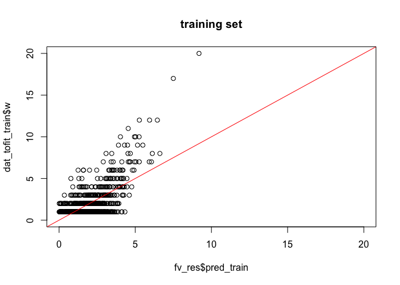
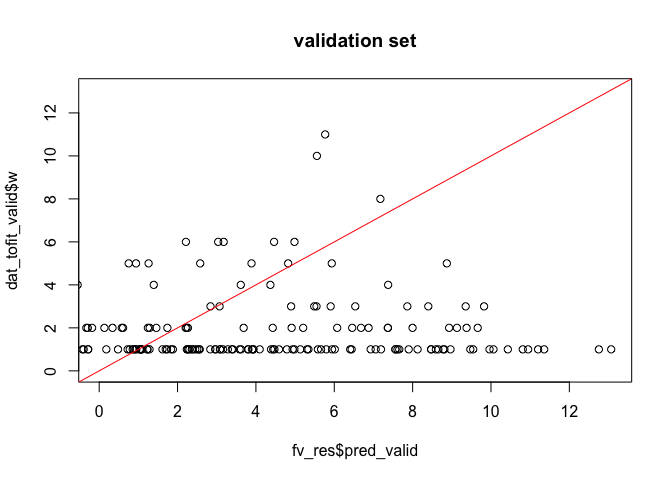

Models For Predicting Commuting Flow From areaId to admin4 units
================
Zhanhao Zhang
8/23/2019

## Introduction

We are going to explore a few models that can predict the commuting
flows from areaId to admin4 units. Attempted models are: gravity model,
disambiguation model, randomForest algorithm, gradient boosting
algorithm, and features mapping
    method.

### Libraries

``` r
library(here)
```

    ## here() starts at /Users/zhangji/Desktop/others/IHME/Macro/TravelingModel/traveling_fit/my_reports

``` r
library(randomForest)
```

    ## randomForest 4.6-14

    ## Type rfNews() to see new features/changes/bug fixes.

``` r
library(gbm)
```

    ## Loaded gbm 2.1.5

``` r
library(data.table)

source(here("scripts/extract_models.R"))
```

    ## 
    ## Attaching package: 'ggplot2'

    ## The following object is masked from 'package:randomForest':
    ## 
    ##     margin

    ## 
    ## Attaching package: 'reshape2'

    ## The following objects are masked from 'package:data.table':
    ## 
    ##     dcast, melt

    ## Classes and Methods for R developed in the
    ## Political Science Computational Laboratory
    ## Department of Political Science
    ## Stanford University
    ## Simon Jackman
    ## hurdle and zeroinfl functions by Achim Zeileis

    ## Loading required package: magrittr

### Required Data

To get these models work, we need a cleaned data that represents the
commuting flows from areaId to admin4. Required columns are listed below
(additional columns are optional and have no effect on the models
below):  
areaId: the areaId of the source.  
admin4Id: the admin4Id of the destination.  
admin2: the admin2 name of the destination.  
aid.pop: the population at the source areaId.  
ad4.pop: the population at the destination admin4.  
ad2.pop: the population at the destination admin2.  
d1: the geographic distance between source areaId and destination
admin2.  
d2: the geographic distance between source areaId and destination
admin4.  
w: the commuting flow from source areaId to destination admin4.

For some models, we need a gravity model trained on old data
(2015-2017). In this case, make sure you prepare an old dataset with
these columns, while you are welcome to have any other additional
columns (pre-cleaned data in rel\_gravity\_dat\_covs.csv is one of the
datasets that satisfy the following requirements):  
N1: source population.  
N2: destination population.  
d: geographic distance between source and destination.  
w: commuting flow from source to destination.

### Obtaining Data

After executing the following chunck of code, you will get several data
that will be needed in the model fittings.  
dat: the dataset containing commuting flows from areaId to admin4.  
N2: a vector containing population at each of the admin2 units, where
the order of these numbers are Baney, Luba, Malabo, and Riaba.  
rel\_gravity\_dat\_covs: a dataframe containing all useful information
about commuting flows from areaId to admin2 units in 2015-2017.

``` r
get_data <- function(data_clean){
  dat <- data_clean[, c("areaId", "admin4Id", "admin2", "aid.pop", "ad4.pop", "d1", "d2", "w")]
  colnames(dat) <- c("areaId", "admin4Id", "admin2", "N1", "N2", "d1", "d", "w")
  dat <- dat[dat$N1 > 0,]
  idx <- c()
  ad2 <- sort(unique(dat$admin2))
  for(i in 1:nrow(dat)){
    idx <- c(idx, which(ad2 == dat[i,]$admin2))
  }
  dat <- data.frame(cbind(dat, data.frame(idx = idx)))
  N2 <- c()
  for(ad in ad2){
    pop <- unique(data_clean[data_clean$admin2==ad,]$ad2.pop)
    N2 <- c(N2, pop)
  }
  return(list(dat = dat, N2 = N2))
}

new_data_clean <- fread(here("data/clean/", "data_clean_pop2018.csv"), sep = ",",
                        header = T)
  
res <- get_data(new_data_clean)
dat <- data.frame(res$dat)
N2 <- res$N2

rel_gravity_dat_covs <- fread(here("data/clean", "rel_gravity_dat_covs.csv"),
                                   sep = ",", header = T)
rel_gravity_dat_covs <- data.frame(rel_gravity_dat_covs)
```

### Gravity Model

Gravity Model typically trains directly on the commuting data from
areaId to admin4 units in 2018. The covariates are: N1 (source
population), N2 (destination population), and d (geographic distance
between areaId and admin4). There are quite a few hyperparameters for
the gravity model:  
1\. poisson regression VS negative binomial regression  
2\. training on commuting data from 2015-2017 VS from 2018  
3\. the cutoff on geographic distance to split the data with two
separate models  
4\. exponential dependency VS power dependency on distance for data
below cutoff

Below is the super function to obtain the gravity model while users can
specify the above four hyperparameters.

``` r
# Correlation plots
cor_plot_single <- function(x, y, res, exp, x_name, y_name, title){
  ###
  # cor_plot_single() is a function for plotting a ratio plot
  #                   and a residual plot for a model with respect
  #                   to a given covariate
  # Inputs:
  #   x: the given covariate to be plotted against
  #   y: the y-axis, in most cases, it is w^{(D)} / w^{(M)}
  #   res: the residual, which is w^{(D)} - w^{(M)}
  #   exp: the expected value of the ratio plot, in most cases,
  #        it is a horizontal line y = 1
  #   x_name: the name for x-axis
  #   y_name: the name for y-axis
  #   title: the name of the title of the plots
  # Outputs:
  #   A list of ggplot() objects, containing one ratio plot and one
  #   residual plot
  ###
  
  x <- as.numeric(x)
  y <- as.numeric(y)
  z <- which(y != 0)
  p2 <- ggplot() +
    geom_point(data = NULL, 
               aes(x = x[z], y = y[z]), col = "red") +
    ggtitle(paste(title, y_name, "vs", x_name)) +
    xlab(x_name) + ylab(y_name) + 
    geom_line(data = NULL, aes(x=x[z], y=exp[z]), col="black") +
    scale_y_log10(limits = c(0.01, 100)) + 
    theme(legend.position = "none")
  p2 <- p2 + scale_x_log10()
  
  p_ratio <- ggplot(data = NULL, 
                    aes(x = x[z], y = y[z])) + geom_bin2d() + scale_x_log10() +
    scale_fill_gradient(low = "yellow", high = "red") +
    ggtitle(paste(title, y_name, "vs", x_name)) +
    xlab(x_name) + ylab(y_name) + 
    geom_line(data = NULL, aes(x=x[z], y=exp[z]), col="black") +
    scale_y_log10(limits = c(0.01, 100)) +
    theme(legend.position = "bottom")
  
  p <- ggplot() + 
    geom_point(data=NULL, 
               aes(x=x, y=res, col="red")) +
    ggtitle(paste(title, "residual plot" , x_name)) +
    xlab(x_name) + ylab("residual plot") + 
    geom_hline(yintercept = 0, col="black") +
    theme(legend.position = "none") +
    scale_x_log10()
  
  p_bin <- ggplot(data = NULL, aes(x = x, y = res)) + geom_bin2d() + scale_x_log10() +
    scale_fill_gradient(low = "yellow", high = "red") +
    ggtitle(paste(title, "heated residual plot" , x_name)) +
    xlab(x_name) + ylab("residual plot") + 
    geom_hline(yintercept = 0, col="black") +
    theme(legend.position = "bottom")
  
  return(list(ratio_plot = p2, heatmap_ratio = p_ratio,
              residual_plot = p, heatmap_res = p_bin))
}

cor_plot_all <- function(title, dat, dir){
  ###
  # cor_plot_all() is a function to generate all plots for a model
  # 4 ratio plots and 4 residual plots, arranged in a 2x4 matrix
  # Inputs:
  #   title: describes the name and features of the model, which is
  #          to be used in the title of the plots and the filename
  #          of the generated image
  #   dat: a dataframe in the form of (w, d, N1, N2, t, pred), an
  #        auxilary data structure for the plotting
  ###
  p1 <- cor_plot_single(dat$d, dat$w / dat$pred, dat$w - dat$pred,
                        rep(1, length(dat$d)), "geographic distance",
                        "w^{(D)} / w^{(M)}", title)
  p2 <- cor_plot_single(dat$N1, dat$w / dat$pred, dat$w - dat$pred,
                        rep(1, length(dat$d)), "source population",
                        "w^{(D)} / w^{(M)}", title)
  p3 <- cor_plot_single(dat$N2, dat$w / dat$pred, dat$w - dat$pred,
                        rep(1, length(dat$d)), "destination population",
                        "w^{(D)} / w^{(M)}", title)

  labels_names <- c("d", "N1", "N2")
  g1 <- ggarrange(p1$ratio_plot, p2$ratio_plot, p3$ratio_plot, ncol = 3, 
                  labels = labels_names)
  g2 <- ggarrange(p1$heatmap_ratio, p2$heatmap_ratio, p3$heatmap_ratio, 
                  ncol = 3, 
                  labels = labels_names)
  g3 <- ggarrange(p1$residual_plot, p2$residual_plot, p3$residual_plot, 
                  ncol = 3, 
                  labels = labels_names)
  g4 <- ggarrange(p1$heatmap_res, p2$heatmap_res, p3$heatmap_res, 
                  ncol = 3, 
                  labels = labels_names)
  g <- ggarrange(g1, g2, g3, g4, nrow = 4)
  
  png(filename = paste(dir, ".png", sep=""), width = 1000, height = 1300)
  print(g)
  dev.off()
}

super_fit.2018 <- function(dat, model_name, use_prev = T, image_name = NULL,
                           cutoff = 0, base_dir = "./", exp_dependence_far = F,
                           exp_dependence_near = T, show_image = F,
                           prev_dat = NULL){
  ###
  # Inputs:
  #   dat: the data to fit
  #   model_name: the name of model to use. Valid names are poisson and negbin.
  #   use_prev: whether or not to use the pretrained model on the dataset whose
  #             commuting flows are obtained in 2015-2017. DEFAULT = TRUE.
  #   image_name: the name of image that visualize the model performance. 
  #               DEFAULT = NULL.
  #   cutoff: the cutoff on geographic distance where we will use two models on
  #           data points from both sides of the cutoff. DEFAULT = 0, which means
  #           no cutoff. In the case of no cutoff, all data points are considered
  #           to be further than the cutoff, so you should only modify 
  #           exp_dependence_far if you want to choose power/exponential dependency
  #           on the geographic distance.
  #   base_dir: the directory to place the image that shows the model performance.
  #             DEFAULT = ./, which is the current directory.
  #   exp_dependence_far: whether to use expoential dependency or power dependency
  #                       on geographical distance for distance above the cutoff.
  #                       DEFAULT = FALSE, which means using power dependency.
  #   exp_dependence_near: whether to use expoential dependency or power dependency
  #                        on geographical distance for distance above the cutoff.
  #                        DEFAULT = TRUE, which means using exoonential dependency.
  #   show_image: whether to plot the image that visualize the model performance.
  #               DEFAULT = FALSE.
  #   prev_dat: the dataset from previous years that can be used to train the
  #             gravity model. Do not have to specify prev_dat if use_prev = F.
  #             DEFAULT = NULL.
  #
  # Output:
  #   ssr: sum of residual squares of the current selected model on the given dataset.
  #   model_far: the fitted model for data points whose distances are above the cutoff.
  #   model_near: the fitted model for data points whose distances are below the cutoff. 
  ###
  
  if(model_name != "poisson" && model_name != "negbin"){
    cat("Usage: model_name = c(\"poisson\", \"negbin\")")
    return(NULL)
  }
  dat_near <- dat[dat$d < cutoff,]
  dat_far <- dat[dat$d >= cutoff,]
  
  pred_far <- NULL
  pred_near <- NULL
  
  if(use_prev){
    res <- super_model_fits(prev_dat, model_name, image_name = NULL,
                            show_plots = F, cutoff = cutoff, use_time = F,
                            exp_dependence_far = exp_dependence_far,
                            exp_dependence_near = exp_dependence_near)
    pred_far <- predict(res$model_far, dat_far, type = "response")
    if(cutoff > 0){
      pred_near <- predict(res$model_near, dat_near, type = "response")
    }
    model_far <- res$model_far
    model_near <- res$model_near
  } else{
    
    formula_far <- w ~ log(N1) + log(N2) + d
    if(!exp_dependence_far){
      formula_far <- w ~ log(N1) + log(N2) + log(d)
    }
    formula_near <- w ~ log(N1) + log(N2) + d
    if(!exp_dependence_near){
      formula_near <- w ~ log(N1) + log(N2) + log(d)
    }
    
    model_far <- NULL
    model_near <- NULL
    if(model_name == "poisson"){
      model_far <- glm(data = dat_far, formula_far, family = "poisson")
      if(cutoff > 0){
        model_near <- glm(data = dat_near, formula_near, family = "poisson")
      }
    } else{
      model_far <- glm.nb(data = dat_far, formula_far)
      if(cutoff > 0){
        model_near <- glm.nb(data = dat_near, formula_near)
      }
    }
    pred_far <- model_far$fitted.values
    if(cutoff > 0){
      pred_near <- model_near$fitted.values
    }
  }
  
  dat_toPlot <- data.frame(N1 = c(dat_far$N1, dat_near$N1),
                           N2 = c(dat_far$N2, dat_near$N2),
                           d = c(dat_far$d, dat_near$d),
                           w = c(dat_far$w, dat_near$w),
                           pred = c(pred_far, pred_near))
  if(show_image){
    cor_plot_all(paste(image_name, "\n", sep=""), dat_toPlot, 
               paste(base_dir, image_name, sep = ""))
  }
  ssr <- sum((dat_toPlot$pred - dat_toPlot$w)^2)
  return(list(ssr = ssr, model_far = model_far, model_near = model_near,
              fitted.values = dat_toPlot$pred, original.values = dat_toPlot$w))
}
```

The best models fit trained on dataset from 2015-2017 and from 2018 are
below (after trying out different combinations of cutoffs,
exponential/power dependencies on geographic distance, and
poisson/negbin regression, I obtained the models with lowest SSR for
training on dataset from 2015-2017 and for training on dataset from
2018):  
To obtain the best fit, execute the following chunck of code, where it
will genereate plots and SSR for each model.

``` r
cutoffs <- c(0, 5, 10, 15, 20, 30, 50, 100, 150) * 1000
results <- matrix(NA, nrow = 8, ncol = length(cutoffs))
colnames(results) <- paste("cutoff=", cutoffs / 1000, "k", sep = "")
models <- c("poisson", "negbin")
bools <- c(T, F)
rownames(results) <- c("poisson_old_exp", "poisson_old_pow", 
                       "poisson_2018_exp", "poisson_2018_pow",
                       "negbin_old_exp", "negbin_old_pow", 
                       "negbin_2018_exp", "negbin_2018_pow")

get_image_name <- function(model_name, use_prev, cutoff, exp_dependence_near){
  train_name <- "trainData=2018"
  if(use_prev){
    train_name <- "trainData=old"
  }
  cutoff_name <- paste("cutoff=", cutoff / 1000, "k", sep = "")
  dep_name <- "near=power"
  if(exp_dependence_near){
    dep_name <- "near=exp"
  }
  return(paste(model_name, train_name, cutoff_name, dep_name, sep = "_"))
}

for(i in 1:length(cutoffs)){
  idx <- 1
  for(m in models){
    for(prev in bools){
      for(dep in bools){
        tryCatch({
        img_name <- get_image_name(m, prev, cutoffs[i], dep)
        results[idx, i] <- super_fit.2018(dat, m, use_prev = prev, 
              image_name = img_name, cutoff = cutoffs[i], 
              base_dir = here("data/images/experiments_areaId2ad4/plots/"), 
              exp_dependence_near = dep, show_image = T,
              prev_dat = rel_gravity_dat_covs)
        }, error = function(cond){return(NA)})
        idx <- idx + 1
      }
    }
  }
}
write.csv(results, here("data/images/experiments_areaId2ad4/summary_ssr.csv"))
```

Trained on 2015-2017 (exponential dependency on geographic distance for
data points whose distance below the cutoff, use negative binommial
regression, cutoff at 50km). SSR = 5662.416.

Trained on 2018 (exponential dependency on geographic distance for data
points whose distance below the cutoff, use poisson regression, cutoff
at 15km). SSR = 3635.204.


The correlation plots for these two models
are:

``` r
# old_model is trained on the dataset in 2015-2017, it uses negative binomial
# regression, cutoff at distance of 50km, and use exponential dependence for
# data points whose distance are below the cutoff
# new_model is trained on the dataset in 2018, it uses poisson
# regression, cutoff at distance of 15km, and use exponential dependence for
# data points whose distance are below the cutoff
# Both models predict on the dataset for 2018

old_model <- super_fit.2018(dat, model_name = "negbin", use_prev = T, 
                            cutoff = 50 * 1000, exp_dependence_near = T,
                            prev_dat = rel_gravity_dat_covs)
new_model <- super_fit.2018(dat, model_name = "poisson", use_prev = F,
                            cutoff = 15 * 1000, exp_dependence_near = T)

ssr_grav_old <- sum((old_model$fitted.values - old_model$original.values)^2)
ssr_grav_new <- sum((new_model$fitted.values - new_model$original.values)^2)

plot(old_model$fitted.values, old_model$original.values, main = "trained on 2015-2017\nnegbin, cutoff = 15km", xlim = c(0, 20), xlab = "fitted.values",
     ylab = "original.values")
abline(a = 0, b = 1, col = "red")
```

<!-- -->

``` r
plot(new_model$fitted.values, new_model$original.values, main = "trained on 2018\npoisson, cutoff = 50km", xlim = c(0, 20), xlab = "fitted.values",
     ylab = "original.values")
abline(a = 0, b = 1, col = "red")
```

<!-- -->

### Disambiguation Model

Disambiguation Model is comprised of two parts: first map areaId to
admin2 units, then using the fact that we are leaving from a known
admin2 unit, calculate the probability of people traveling to each of
its admin4 units based on their population. The first part is fitted
using gravity model, either through commuting data from 2015-2017, or
through data from 2018. The second part is fitted based on pop^k, where
pop is the population at each admin4 unit. After several trials of
training using Particle Markov Chain Monte Carlo algorithm, I get a set
of converged k for each of the admin2 units: 0.2345718 for Baney,
0.5415359 for Luba, 0.4763921 for Malabo, and 2.4926470 for Riaba.  
Note: Optimal Ks are obtained by assuming that the first part of the
disambiguation model (areaId to admin2) is perfect, where the predicted
commuting flow from areaId to admin2 is exactly the same as the original
commuting flow, and then under this assumption, we use the particle MCMC
to get the optimal K for pop. Therefore, it is possible that the SSR for
optimal K is larger than some other K values due to the effect of the
model in the first
part.

``` r
disambiguation_model <- function(dat, N2, model_near = NULL, model_far = NULL, 
                                 cutoff = 0, pop_vec = 0){
  ###
  # Inputs:
  #   dat: the data to fit
  #   N2: a vector containing population at each of the admin2 units, in the
  #       order of Baney, Luba, Malabo, and Riaba
  #   model_near: the model for data points whose distance is below the cutoff.
  #               Do not have to specify model_near when cutoff = 0. DEFAULT = NULL.
  #   model_far: the model for data points whose distance is above the cutoff.
  #              DEFAULT = NULL.
  #   cutoff: the cutoff on geographical distance where we will use two separate
  #           models for both sides. DEFAULT = 0.
  #   pop_vec: a vector containing the power of population at admin4 units in the
  #            second half part of the disambiguation model. If specifying a single
  #            number for pop_vec, then all admin2 regions will use the same values
  #            for population's exponents. DEFAULT = 0.
  #
  # Output:
  #   return the predicted commuting flows from areaId to admin4 units. The order
  #   of the predicted values is consistent with the input dataframe dat.
  ###
  
  if(length(pop_vec) == 1){
    pop_vec <- rep(pop_vec, length(unique(N2)))
  }
  
  dat_N2 <- data.frame(idx = unique(sort(dat$idx)), N2 = N2)
  
  curr_dat <- data.frame(cbind(dat, data.frame(row_num = 1:nrow(dat))))
  dat_near <- curr_dat[curr_dat$d < cutoff,]
  dat_far <- curr_dat[curr_dat$d >= cutoff,]

  pred_df <- c()
  if(nrow(dat_far) > 0){
    rel_far <- merge(dat_far[, !colnames(dat_far) %in% c("N2", "d")], 
                     dat_N2, by = "idx")
    names(rel_far) <- gsub("d1", "d", names(rel_far))
    pred_far <- predict(model_far, rel_far, type = "response")
    pred_df <- data.frame(rbind(data.frame(pred_df), 
                                data.frame(row_num = rel_far$row_num, 
                                           pred.ad2 = pred_far)))
  }
  if(nrow(dat_near) > 0){
    rel_near <- merge(dat_near[, !colnames(dat_near) %in% c("N2", "d")], 
                     dat_N2, by = "idx")
    names(rel_near) <- gsub("d1", "d", names(rel_near))
    pred_near <- predict(model_near, rel_near, type = "response")
    pred_df <- data.frame(rbind(data.frame(pred_df), 
                                data.frame(row_num = rel_near$row_num, 
                                           pred.ad2 = pred_near)))
  }
  curr_dat <- merge(curr_dat, pred_df, by = "row_num")
  
  w_df <- c()
  for(i in sort(unique(curr_dat$idx))){
    rel_dat <- curr_dat[curr_dat$idx == i,]
    p <- rel_dat$N2 ^ pop_vec[i]
    p <- p / sum(p)
    pred_ad4 <- rel_dat$pred.ad2 * p
    w_df <- data.frame(rbind(data.frame(w_df), data.frame(row_num = rel_dat$row_num,
                                                          pred.ad4 = pred_ad4)))
  }
  curr_dat <- merge(curr_dat, w_df, by = "row_num")
  curr_dat <- curr_dat[order(curr_dat$row_num),]
  return(curr_dat$pred.ad4)
}
```

The correlation plots for the two parts of the disambiguation model
are:  

Though the fit looks reasonable for now, this model works very poorly
for predicting commuting flow from areaId to admin4. One of the possible
reasons is that the probability of traveling to each admin4 unit is
proportional to pop^k (according to the assumption of the disambiguation
model), which smooth out the probability for each admin4 unit. In other
word, probabilities of admin4 units within the same admin2 area are
close to each other. However, in reality, there are usually very few
amount of people depart from each areaId, while there are a lot of
admin4 units within an admin2 area, so there is only a tiny amount of
commuting flow allocated to each admin4 unit. The correlation plot of
commuting flow from areaId to admin4 looks like the following (lowest
possible SSR = 8014.962):

``` r
pop_vec <- c(0.2345718, 0.5415359, 0.4763921, 2.4926470)
prev_model <- super_fit.2018(dat, "negbin", use_prev = T, cutoff = 20 * 1000,
                             prev_dat = rel_gravity_dat_covs)
res <- disambiguation_model(dat, model_near = prev_model$model_near, 
                             model_far = prev_model$model_far, 
                             N2, pop_vec = pop_vec, cutoff = 20 * 1000)
plot(res, dat$w, main = "disambiguation model", xlab = "fitted.values",
     ylab = "original.values", xlim = c(0, 20))
abline(a = 0, b = 1, col = "red")
```

<!-- -->

``` r
dat_toplot <- data.frame(N1 = dat$N1, N2 = dat$N2, d = dat$d, w = dat$w,
                         pred = res)
cor_plot_all(title = "disambiguationModel_K=optimal\n", dat = dat_toplot, 
    dir = here("data/images/experiments_areaId2ad4/plots/disambiguationModel_K=optimal"))
```

    ## quartz_off_screen 
    ##                 2

``` r
knitr::include_graphics(here("data/images/experiments_areaId2ad4/plots/disambiguationModel_K=optimal.png"))
```

<!-- -->

``` r
ssr_dis <- sum((res - dat$w)^2)
print(paste("Optimal K: ssr =", sum((res - dat$w)^2)))
```

    ## [1] "Optimal K: ssr = 31510.1103111554"

``` r
res <- disambiguation_model(dat, model_near = prev_model$model_near, 
                             model_far = prev_model$model_far, 
                             N2, pop_vec = 1, cutoff = 20 * 1000)
plot(res, dat$w, main = "disambiguation model K = 1", xlab = "fitted.values",
     ylab = "original.values", xlim = c(0, 20))
abline(a = 0, b = 1, col = "red")
```

<!-- -->

``` r
dat_toplot <- data.frame(N1 = dat$N1, N2 = dat$N2, d = dat$d, w = dat$w,
                         pred = res)
cor_plot_all(title = "disambiguationModel_K=1\n", dat = dat_toplot, 
    dir = here("data/images/experiments_areaId2ad4/plots/disambiguationModel_K=1"))
```

    ## quartz_off_screen 
    ##                 2

``` r
knitr::include_graphics(here("data/images/experiments_areaId2ad4/plots/disambiguationModel_K=1.png"))
```

<!-- -->

``` r
ssr_dis <- sum((res - dat$w)^2)
print(paste("K = 1: ssr =", sum((res - dat$w)^2)))
```

    ## [1] "K = 1: ssr = 15235.9544074813"

``` r
res <- disambiguation_model(dat, model_near = prev_model$model_near, 
                             model_far = prev_model$model_far, 
                             N2, pop_vec = 0, cutoff = 20 * 1000)
plot(res, dat$w, main = "disambiguation model K = 0", xlab = "fitted.values",
     ylab = "original.values", xlim = c(0, 20))
abline(a = 0, b = 1, col = "red")
```

<!-- -->

``` r
dat_toplot <- data.frame(N1 = dat$N1, N2 = dat$N2, d = dat$d, w = dat$w,
                         pred = res)
cor_plot_all(title = "disambiguationModel_K=0\n", dat = dat_toplot, 
    dir = here("data/images/experiments_areaId2ad4/plots/disambiguationModel_K=0"))
```

    ## quartz_off_screen 
    ##                 2

``` r
knitr::include_graphics(here("data/images/experiments_areaId2ad4/plots/disambiguationModel_K=0.png"))
```

<!-- -->

``` r
ssr_dis <- sum((res - dat$w)^2)
print(paste("K = 0: ssr =", sum((res - dat$w)^2)))
```

    ## [1] "K = 0: ssr = 59918.4169232031"

### RandomForest Algorithm

``` r
rf <- randomForest(x = dat[, c("N1", "N2", "d")], y = dat$w, ntree = 5000)
ssr_rf <- sum((rf$predicted - dat$w)^2)
plot(rf$predicted, dat$w, main = "randomForest performance",
     xlab = "predicted values", ylab = "original commuting flow",
     xlim = c(0, 20))
abline(a = 0, b = 1, col = "red")
```

<!-- -->

``` r
dat_toplot <- data.frame(N1 = dat$N1, N2 = dat$N2, d = dat$d, w = dat$w,
                         pred = rf$predicted)
cor_plot_all(title = "Random Forest Algorithm\n", dat = dat_toplot, 
    dir = here("data/images/experiments_areaId2ad4/plots/randomForest"))
```

    ## quartz_off_screen 
    ##                 2

``` r
knitr::include_graphics(here("data/images/experiments_areaId2ad4/plots/randomForest.png"))
```

<!-- -->

``` r
print(ssr_rf)
```

    ## [1] 3805.841

### Gradient Boosting Algorithm

``` r
gb <- gbm(w ~ log(N1) + log(N2) + log(d), data = dat, n.trees = 20000,
          interaction.depth = 3, train.fraction = 0.8, cv.folds = 5)
```

    ## Distribution not specified, assuming gaussian ...

``` r
ssr_gb <- sum((gb$fit - dat$w)^2)
plot(gb$fit, dat$w, main = "Gradient Boosting Performance", xlim = c(0, 20),
     xlab = "predicted values", ylab = "original commuting flows")
abline(a = 0, b = 1, col = "red")
```

<!-- -->

``` r
dat_toplot <- data.frame(N1 = dat$N1, N2 = dat$N2, d = dat$d, w = dat$w,
                         pred = gb$fit)
cor_plot_all(title = "Gradient Boosting Algorithm\n", dat = dat_toplot, 
    dir = here("data/images/experiments_areaId2ad4/plots/gradientBoosting"))
```

    ## quartz_off_screen 
    ##                 2

``` r
knitr::include_graphics(here("data/images/experiments_areaId2ad4/plots/gradientBoosting.png"))
```

<!-- -->

``` r
print(ssr_gb)
```

    ## [1] 1285.129

You may notice that the Gradient Boosting Algorithm gives the best fit,
for it gives the lowest SSR. However, if we take a closer look by
splitting up the SSR for training set and validation set, we will
realize that the story is completely
different.

``` r
ssr_train <- gb$train.error[length(gb$train.error)] * nrow(dat) * gb$train.fraction
ssr_valid <- gb$valid.error[length(gb$valid.error)] * nrow(dat) * (1 - gb$train.fraction)
print(paste("SSR_TRAIN =", ssr_train, "SSR_VALID =", ssr_valid))
```

    ## [1] "SSR_TRAIN = 16.5498914784026 SSR_VALID = 1267.48417154859"

As you can see, the gradient boosting algorithm suffers from severe
overfitting.

### Features Mapping Method

The last approach, which is also subject to overfitting, is using the
idea of features mapping, where we map three features (source
population, destination population, and geographic distance) into
hundreds or even thousands of features, and then doing a regression on
those features for prediction. One thing to be aware of is that using
linear regression may give negative predictions, so one way to deal with
this is to use abs() or relu() to wrap the predicted values. Both
methods give similar results, where training accuracy is super high,
while the predicted values for the validation set can hardly fit along
the red line. Poisson regression has also be tried, but the sum of
residuals squares shoots up very quickly for the validation set as we
increase the number of features to get a better fit for the training
set. Thus, so far the best choice for the features mapping method is to
use linear regression and then a abs() or relu() as an activation
function.

``` r
feature_vector <- function(num_features_vec, dat_train, dat_valid, init_sd = 1){
  ssr_train_all <- c()
  ssr_valid_all <- c()
  ssr_total <- 10 ^ 6
  
  pre_train <- NULL
  pre_valid <- NULL
  
  for(num_features in num_features_vec){
    set.seed(123)
    transform_mat <- matrix(rnorm(3 * num_features, sd = init_sd), nrow = 3)
    
    train_orig_covs <- as.matrix(dat_train[, c("N1", "N2", "d")])
    train_features <- sin(train_orig_covs %*% transform_mat)
    train_dat_featured <- data.frame(cbind(data.frame(w = dat_train$w), train_features))
    valid_orig_covs <- as.matrix(dat_valid[, c("N1", "N2", "d")])
    valid_features <- sin(valid_orig_covs %*% transform_mat)
    valid_dat_featured <- data.frame(cbind(data.frame(w = dat_valid$w), valid_features))
    
    lm_fet <- lm(data = train_dat_featured, w ~ .)
    ssr_train <- sum((abs(lm_fet$fitted.values) - train_dat_featured$w)^2)
    pred_valid <- predict(lm_fet, valid_dat_featured, type = "response")
    ssr_valid <- sum((pred_valid - valid_dat_featured$w)^2)
    
    if(ssr_total > ssr_train + ssr_valid){
      ssr_total <- ssr_train + ssr_valid
      pre_train <- abs(lm_fet$fitted.values)
      pre_valid <- pred_valid
    }
    
    ssr_train_all <- c(ssr_train_all, ssr_train)
    ssr_valid_all <- c(ssr_valid_all, ssr_valid)
  }
  
  plot(num_features_vec, ssr_train_all, type = "l", lwd = 2, col = "blue",
       main = "Training and Validation SSR vs #vectors", xlab = "#vectors",
       ylab = "SSR", ylim = c(0, max(ssr_train_all, ssr_valid_all)))
  lines(num_features_vec, ssr_valid_all, lwd = 2, col = "red")
  lines(num_features_vec, ssr_train_all + ssr_valid_all, lwd = 2, col = "green")
  legend("topleft", c("train SSR", "valid SSR", "total SSR"), 
         col = c("blue", "red", "green"),
         bg = "gray", cex = 0.6, lwd = 2)
  return(list(pred_train = pre_train, pred_valid = pred_valid))
}

dat_tofit <- dat
colnames(dat_tofit) <- c("areaId", "admin4Id", "admin2", "N1", "N2", "d1",
                         "d", "w", "idx")

split_tofit <- sample(1:nrow(dat_tofit), 0.8 * nrow(dat_tofit))
dat_tofit_train <- dat_tofit[split_tofit,]
dat_tofit_valid <- dat_tofit[-split_tofit,]
fv_res <- feature_vector(c((1:40) * 20), dat_tofit_train, dat_tofit_valid,
                         init_sd = 1)
```

<!-- -->

``` r
plot(fv_res$pred_train, dat_tofit_train$w, main = "training set",
     xlim = c(0, max(fv_res$pred_train, dat_tofit_train$w)),
     ylim = c(0, max(fv_res$pred_train, dat_tofit_train$w)))
abline(a = 0, b = 1, col = "red")
```

<!-- -->

``` r
plot(fv_res$pred_valid, dat_tofit_valid$w, main = "validation set",
     xlim = c(0, max(fv_res$pred_valid, dat_tofit_valid$w)),
     ylim = c(0, max(fv_res$pred_valid, dat_tofit_valid$w)))
abline(a = 0, b = 1, col = "red")
```

<!-- -->

``` r
dat_toplot <- data.frame(N1 = c(dat_tofit_train$N1, dat_tofit_valid$N1), 
                         N2 = c(dat_tofit_train$N2, dat_tofit_valid$N2), 
                         d = c(dat_tofit_train$d, dat_tofit_valid$d), 
                         w = c(dat_tofit_train$w, dat_tofit_valid$w),
                         pred = c(fv_res$pred_train, fv_res$pred_valid))
cor_plot_all(title = "Features Mapping Method\n", dat = dat_toplot, 
    dir = here("data/images/experiments_areaId2ad4/plots/featuresMapping"))
```

    ## quartz_off_screen 
    ##                 2

``` r
knitr::include_graphics(here("data/images/experiments_areaId2ad4/plots/featuresMapping.png"))
```

<!-- -->

``` r
ssr_fm <- sum((fv_res$pred_train - dat_tofit_train$w)^2) + 
          sum((fv_res$pred_valid - dat_tofit_valid$w)^2)
```

### Summary

``` r
ssr_all <- c(ssr_grav_old, ssr_grav_new, ssr_dis, ssr_rf, ssr_gb, ssr_fm)
names_all <- c("Gravity Model Trained On 2015-2017", "Gravity Model Trained On 2018",
               "Disambiguation Model", "Random Forest Algorithm",
               "Gradient Boosting Algorithm", "Features Mapping Method")
ssr_df <- data.frame(models = names_all, SSR = ssr_all)
knitr::kable(ssr_df, caption = "")
```

| models                             |       SSR |
| :--------------------------------- | --------: |
| Gravity Model Trained On 2015-2017 |  5662.416 |
| Gravity Model Trained On 2018      |  3635.204 |
| Disambiguation Model               | 59918.417 |
| Random Forest Algorithm            |  3805.841 |
| Gradient Boosting Algorithm        |  1285.129 |
| Features Mapping Method            |  8607.453 |
