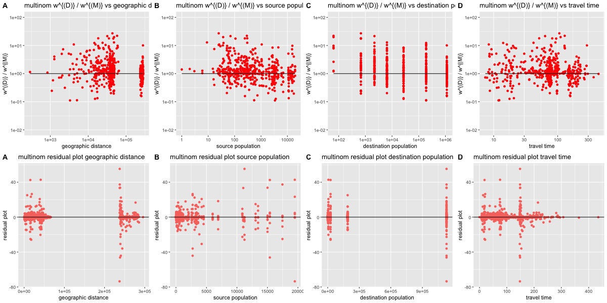
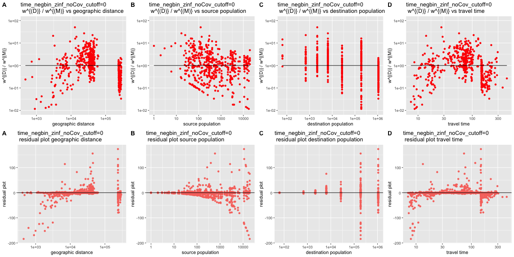

```{r setup, include=FALSE}
knitr::opts_chunk$set(echo = TRUE)
```
## Models to explore
We are going to explore several different models on the traveling data. There are several variations for the models:  
Type of model: poisson regression, negative binomial regression, zero-inflated negative binomial regression, multinomial regression.  
Representation of distance: geographic distance or travel time between source and destination.  
Whether additional covariates are added: if added, then the added covariates are indicators for ad2 and geographic distance or travel time from source location to Malabo.  
Cutoffs: a cutoff on geographic distance or travel time where different models are adopted and data are fitted separately on the two sides of the cutoff boundary. We assume exponential dependence on geographic distance or travel time for near trips, while power dependence for far trips.  

## Packages needed

```{r, eval=FALSE}
library(data.table)
library(MASS)
library(ggplot2)
library(reshape2)
library(stringr)
library(pscl)
library(nnet)
library(ggpubr)
```

## Read data
```{r, eval=FALSE}
data <- read.csv("travel_times.csv", header = T)
colnames <- colnames(data)
BI_survey_data <- read.csv("BI_survey_data.csv", header = T)
BI_survey_data <- data.table(BI_survey_data)
```

## Cleaned data for each model
To fit the data into each model, we have to clean the data first. The cleaned data are saved as [name].csv, where [name] is the same as their dataframes' names.  
rel_gravity_dat.csv: rel_gravity_dat, to feed into poisson regression, negative binomial regression, and zero-inflated negative binomial regression without additional covariates.  
rel_gravity_dat_covs.csv: rel_gravity_dat_covs, to feed into poisson regression, negative binomial regression, and zero-inflated negative binomial regression with additional covariates (indicators for ad2 and geometric distance/travel time from source location to Malabo).  
rel_dat_mul.csv: rel_dat_mul, to feed into multinomial regression (a dataframe that represents commuting flow w by duplicating the row by w times).  
test_dat_mul.csv: test_dat_mul, to make it easier for prediction and get the sum of residuals (a dataframe that represents commuting flow w by adding an additional column, w_total, in each row to indicate the total commuting flow out of each given areaId).

## Helper functions
Calculate the distance between two coordinates.
```{r, eval=FALSE}
dist <- function(src_cor, dest_cor){
  ###
  # dist() is a function that calculates the geographic distance of a
  # given pair of source and destination locations
  # Inputs:
  #   src_cor: the coordinates of source location
  #   dest_cor: the coordinates of destination location
  # Outputs:
  #   the geographic distance between these two locations
  ###
  
  return(sqrt((src_cor$X - dest_cor$X)^2 + (src_cor$Y - dest_cor$Y)^2))
}
```

Get the population of a given location
```{r, eval=FALSE}
pop <- function(str){
  ###
  # pop() is a function that gets the population of a given location
  # Inputs:
  #   str: the string indicating the location, which is formatted like
  #        "ti_ban"
  # Outputs
  #   the population of the given location
  ###
  
  # convert the string format (ex. from "ti_ban" to "Baney")
  # notice that "ti_mal" indicates traveling to Peri or Malabo
  # so for "ti_mal", the str will be converted to 
  # a vector ("Peri", "Malabo"), which will be explained in more
  # details in the documentation for cvt()
  str <- cvt(str)
  
  # if the destination is the mainland of equatorial guinea, then
  # return its population directly
  # this is calculated by first getting the population of whole
  # Equatorial Guinea for year 2015-2017 from the IHME's database, 
  # take the average of these three, and subtract them by the 
  # population of the Bioko island, which is the sum of population 
  # of all areaIds in the BI_survey_data
  if(length(str) == 1 && str=="EG_Mainland"){
    return(1071785)
  }
  
  # if the destination is somewhere in the bioko island, then the
  # population of that location is calculated by summing over
  # population in all areaIds that belong to that location
  res <- c()
  for(s in str){
    res <- c(res, BI_survey_data[ad2==s, pop])
  }
  
  # if the input str is invalid, then return 0
  if(length(res) == 0){
    return(0)
  }
  return(sum(res))
}
```

Convert the strings that indicate travel destinations in the column names to the name of that location. For instance, "ti_ban" to "Baney".
```{r, eval=FALSE}
cvt <- function(str){
  ###
  # cvt() is a function that converts a string to a more readable format
  # for instance, it will convert "ti_ban" to "Baney"
  # For "ti_mal", since it indicates traveling to Malabo and Peri, this 
  # function will convert it to a vector ("Malabo", "Peri")
  # Inputs:
  #   str: the string to be converted, which is formatted as "ti_ban"
  # Outputs:
  #   the more readable version of the string
  #   return NULL for illegal input
  ###
  
  if(str == "ti_ban"){
    return("Baney")
  } else if(str == "ti_mal"){
    return(c("Malabo", "Peri"))
  } else if(str == "ti_lub"){
    return("Luba")
  } else if(str == "ti_ria"){
    return("Riaba")
  } else if(str == "ti_mok"){
    return("Moka")
  } else if(str == "ti_ure"){
    return("Ureka")
  } else if(str == "to"){
    return("EG_Mainland")
  }
  return(NULL)
}
```

Get the coordinates of a location. The coordinates is looked up from wikipedia, and the coordinates adopted are at the center of each location.
```{r, eval=FALSE}
loc2 <- function(str){
  ###
  # loc2() is a function that returns the coordinates of a given location
  # Inputs:
  #   str: the string that stores the destination location to lookup
  # Outputs:
  #   a list, with X and Y coordinates of the location
  ###
  
  # convert the input string into a more readable format
  str <- cvt(str)
  
  if(length(str) == 1 && str == "EG_Mainland"){
    return(list(X = 583415.41, Y = 204498.92))
  }
  
  # if the input is illegal, return NULL
  if(length(str) == 0){
    return(NULL)
  }
  
  # if the destinations are Malabo and Peri, return the center
  # of these two locations
  if(length(str) == 2){
    return(list(X = 474872, Y = 414725))
  }
  if(str == "Baney"){
    return(list(X = 490746, Y = 408967))
  } else if(str == "Luba"){
    return(list(X = 450016, Y = 381345))
  } else if(str == "Riaba"){
    return(list(X = 474081, Y = 373967))
  } else if(str == "Moka"){
    return(list(X = 462970, Y = 368444))
  } else if(str == "Ureka"){
    return(list(X = 446303, Y = 361082))
  }
}
```

An alternative way to figure out the coordinates for each location. It is calculated based on the weighted average of coordinates of all areaIds that belong to the location, where the weight is the population of those areaIds.
```{r, eval=FALSE}
loc <- function(str){
  str <- cvt(str)
  if(length(str) == 1 && str == "EG_Mainland"){
    return(list(X = 583415.41, Y = 204498.92))
  }
  if(length(str) == 0){
    return(NULL)
  }
  return(loc_helper(str))
}

loc_helper <- function(str){
  res <- c()
  for(s in str){
    res <- rbind(res, BI_survey_data[ad2==s, .(X, Y, pop)])
  }
  denom <- sum(res$pop)
  return(list(X = sum(res$X * res$pop) / denom, 
              Y = sum(res$Y * res$pop) / denom))
}
```

Get the travel time from a source location (given by areaID) to a destination location (given by its name). The travel time from Malabo to the mainland of equatorial guinea is obtained from google map. Notice that for each offland travels, people have to travel to Malabo first before they travel offland to the mainland of Equatorial Guinea, so the travel time from that location to the mainland equals to the time from Malabo to the mainland (Bata city) plus the travel time from the source location to Malabo.  
One thing to be aware of is that we have travel time from each areaId to each areaId, but we only need the travel time from an areaId to one of the 7 destinations (Baney, Malabo, ...), so the travel time is calculated on the average time of the source areaId to all other areaIds that belong to the destination.
```{r, eval=FALSE}
tt <- function(id_src, str_dest){
  ###
  # tt() is a function that calculates the travel time between a
  # source location to a destination location
  # Inputs:
  #   id_src: the areaId of the source location
  #   str_dest: the name (formated as "ti_ban") of the 
  #             destination location
  # Outputs:
  #   the travel time between these two locations
  #
  # Notice that the only information available to us are the travel time
  # between areaId and areaId, while we need to calculate the travel
  # time between areaId and a location (which contains multiple areaIds).
  # So the travel time is calculated based on the average travel time
  # between the areaId of source location and all other areaIds that
  # belong to the destination location
  ###
  
  # Conver the name of destination to a more readable version
  str_dest <- cvt(str_dest)
  
  # If the destination is the mainland of equatorial guinea, then
  # people have to travel from their source location to Malabo first,
  # and then take airplanes from Malabo to the mainland (the Bata City)
  # It takes them 140 minutes to travel from Malabo to the Bata City, 
  # which includes the waiting time at the airport
  if(length(str_dest) == 1 && str_dest == "EG_Mainland"){
    return(140 + tt(id_src, "ti_mal"))
  }
  
  # return NULL for illegal inputs
  if(length(str_dest) == 0){
    return(NULL)
  }
  
  # Otherwise, of the travel destination is somewhere inside the
  # Bioko island, then return the average travel time between the
  # source areaId to the destination
  sum <- 0
  cnt <- 0
  # The for-loop here is to handle the case where str_dest may be
  # a vector ("Malabo", "Peri")
  for(s in str_dest){
    areaID <- unique(BI_survey_data[ad2==s, areaId])
    cnt <- cnt + length(areaID)
    for(id in areaID){
      t <- data[data$areaId==id_src,][paste("X", id, sep="")]
      t <- t[1,]
      sum <- sum + t
    }
  }
  return(sum / cnt)
}
```

Stores all the travel destinations from the BI_survey_data's column names.
```{r, eval=FALSE}
centrals <- c("to", "ti_ban", "ti_mal", "ti_lub", "ti_ria", 
              "ti_mok", "ti_ure")
```

Fetch the commuting flow from a given areaId to a given destination from the BI_survey_data.
```{r, eval=FALSE}
C <- function(src_id, dest){
  ###
  # C() is a function that gets the commuting flow between the given
  # source and destination
  # Inputs:
  #   src_id: the areaId of the source location
  #   dest: the name of the destination location (formatted as "ti_ban")
  # Outputs:
  #   the commuting flow between these two locations
  ###
  res <- BI_survey_data[areaId==src_id,][[dest]]
  
  # return 0 if the src_id is not found
  if(length(res) == 0){
    return(0)
  }
  return(res)
}
```

# Negative Binomial Regressions
### The Negative Binomial Regression will be displayed in two parts: ordinary Negative Binomial Regression, and zero inflated Negative Binomial Regression. The cor_plot_noBox2() function below is a helper function that can generate correlation plots to visualize either of these models. 

A helper function to obtain the correlation plots between the ratio of true value to fitted value and one of the specified covariates (source population, destination population, distance, and travel time). If the true values are 0, then the plots show the relations between the fitted value to that specified covariate.
```{r}
# Correlation plots
cor_plot_single <- function(x, y, res, exp, x_name, y_name, title){
  ###
  # cor_plot_single() is a function for plotting a ratio plot
  #                   and a residual plot for a model with respect
  #                   to a given covariate
  # Inputs:
  #   x: the given covariate to be plotted against
  #   y: the y-axis, in most cases, it is w^{(D)} / w^{(M)}
  #   res: the residual, which is w^{(D)} - w^{(M)}
  #   exp: the expected value of the ratio plot, in most cases,
  #        it is a horizontal line y = 1
  #   x_name: the name for x-axis
  #   y_name: the name for y-axis
  #   title: the name of the title of the plots
  # Outputs:
  #   A list of ggplot() objects, containing one ratio plot and one
  #   residual plot
  ###
  
  x <- as.numeric(x)
  y <- as.numeric(y)
  z <- which(y != 0)
  p2 <- ggplot() +
    geom_point(data = NULL, 
               aes(x = x[z], y = y[z]), col = "red") +
    ggtitle(paste(title, y_name, "vs", x_name)) +
    xlab(x_name) + ylab(y_name) + 
    geom_line(data = NULL, aes(x=x[z], y=exp[z]), col="black") +
    scale_y_log10(limits = c(0.01, 100)) + 
    theme(legend.position = "none")
    p2 <- p2 + scale_x_log10()
  
  p <- ggplot() + 
    geom_point(data=NULL, 
               aes(x=x, y=res, col="red")) +
    ggtitle(paste(title, "residual plot" , x_name)) +
    xlab(x_name) + ylab("residual plot") + 
    geom_hline(yintercept = 0, col="black") +
    theme(legend.position = "none") +
    scale_x_log10()

  return(list(ratio_plot = p2, residual_plot = p))
}

cor_plot_all <- function(title, dat, dir){
  ###
  # cor_plot_all() is a function to generate all plots for a model
  # 4 ratio plots and 4 residual plots, arranged in a 2x4 matrix
  # Inputs:
  #   title: describes the name and features of the model, which is
  #          to be used in the title of the plots and the filename
  #          of the generated image
  #   dat: a dataframe in the form of (w, d, N1, N2, t, pred), an
  #        auxilary data structure for the plotting
  ###
  p1 <- cor_plot_single(dat$d, dat$w / dat$pred, dat$w - dat$pred,
                        rep(1, length(dat$d)), "geographic distance",
                        "w^{(D)} / w^{(M)}", title)
  p2 <- cor_plot_single(dat$N1, dat$w / dat$pred, dat$w - dat$pred,
                        rep(1, length(dat$d)), "source population",
                        "w^{(D)} / w^{(M)}", title)
  p3 <- cor_plot_single(dat$N2, dat$w / dat$pred, dat$w - dat$pred,
                        rep(1, length(dat$d)), "destination population",
                        "w^{(D)} / w^{(M)}", title)
  p4 <- cor_plot_single(dat$t, dat$w / dat$pred, dat$w - dat$pred,
                        rep(1, length(dat$d)), "travel time",
                        "w^{(D)} / w^{(M)}", title)
  g1 <- ggarrange(p1$ratio_plot, p2$ratio_plot, p3$ratio_plot,    
                  p4$ratio_plot, ncol = 4, 
                  labels = c("A", "B", "C", "D"))
  g2 <- ggarrange(p1$residual_plot, p2$residual_plot, p3$residual_plot, 
                  p4$residual_plot, ncol = 4, 
                  labels = c("A", "B", "C", "D"))
  g <- ggarrange(g1, g2, nrow = 2)
  
  png(filename = paste(dir, ".png", sep=""), width = 1200, height = 600)
  print(g)
  dev.off()
}
```

## Negative Binomial Regression and Zero Inflated Negative Binomial Regression Without Additional Covariates
Construct a new dataframe, gravity_dat, that stores the commuting flow, source population, destination population, travel time, and geographic distance between each pair (areaId, destination name).  
Inputs of the gravity_dat:  
&nbsp;&nbsp;&nbsp;w: commuting flow  
&nbsp;&nbsp;&nbsp;N1: population at source location  
&nbsp;&nbsp;&nbsp;N2: population at destination location  
&nbsp;&nbsp;&nbsp;d: geographic distance  
&nbsp;&nbsp;&nbsp;t: travel time  
Notice that the gravity_dat includes both geographic distance and travel time, while during the model fitting, it will use only one of them. The reason to include both is to make it easier to assess the model performance by selecting either geographic distance or travel time in an easy manner, without having to go through the whole data cleaning process again.
```{r, eval=FALSE}
gravity_dat <- c()

# The first for-loop iterate through all possible source locations
# which are areaIds in the BI_survey_data
for(i in 1:nrow(BI_survey_data)){
  dat <- BI_survey_data[i]
  
  # The second for-loop iterate through all possible destinations
  for(dest in centrals){
    w <- C(dat$areaId, dest)
    N1 <- sum(BI_survey_data[areaId==dat$areaId, pop])
    N2 <- pop(dest)
    src_cor <- BI_survey_data[areaId==dat$areaId, .(X, Y)]
    dest_cor <- loc(dest)
    d <- dist(src_cor, dest_cor)
    if(dest == "to"){
      d <- dist(src_cor, loc2("ti_mal"))
      d <- d + dist(loc2("ti_mal"), dest_cor)
    }
    t <- tt(dat$areaId, dest)
    gravity_dat <- rbind(gravity_dat, 
                list(areaId=dat$areaId, dest=dest,
                     w = w, N1 = N1, N2 = N2, d = d, t = t))
  }
}
gravity_dat <- data.frame(gravity_dat)
```

Get rid of the last row, which comes from Ureka to Ureka. Ureka has only one areaId in the BI_survey_data, and since the travel time is calculated based on the average time from the areaId of source location to all areaIds belong to the destination, we get a 0 for travel time from Ureka to Ureka. Without moving this row, problems will arise.
```{r, eval=FALSE}
rel_gravity_dat <- gravity_dat[1:1357,]
```

A helper function to generate correlation plots on a given cutoff. The cutoff can be on geographical distance or on travel time. Also, this function can be slightly modified to switch between negative binomial regression and zero inflated negative binomial regression. The return values of this function include the fitted models and the true values on both sides of the cutoff.  
One thing to notice is that if the cutoff travel distance is greater than 60K, I will remove the covariate N2, because beyond that cutoff, the trips in with higher distance than cutoff only have one destination, the mainland Equitorial Guinea, and thus the destination population will always be the same. Without removing this feature, the zero inflated model will crash.
```{r, eval=FALSE}
plot_cutoff <- function(cutoff, base_dir, model){
  ###
  # plot_cutoff() is a function that perform fit of a model under a
  # given cutoff, and then generate ratio plots and residual plots
  # to visualize the performance of the model
  # Inputs:
  #   cutoff: the cutoff value, on geometric distance or travel time
  #   base_dir: the base directory to save the plots
  #   model: the name of the model
  # Outputs:
  #   a list containing the fitted models of data on both sides of the
  #   cutoff, as well as the true values of the response variable of the
  #   data on these two sides
  #
  # Notice:
  #   this script should be slightly modified if you want to switch
  #   between geographic distance and travel time, or if you want to
  #   switch between poisson regression, negative binomial regression,
  #   and zero-inflated negative binomial regression models
  #   The places to modify will be marked in the comments below
  ###
  
  ###[CHANGE]
  # rel_gravity_dat$t for travel time
  # rel_gravity_dat$d for geographic distance
  rel_gravity_dat3 <- rel_gravity_dat[rel_gravity_dat$t > cutoff,]
  rel_gravity_dat4 <- rel_gravity_dat[rel_gravity_dat$t <= cutoff,]
  
  ###[CHANGE]
  # in glm.nb, glm, or zeroinfl, switch between t_nb and d_nb
  # t_nb for travel time, d_nb for geographic distance
  
  # Negative Binomial Regression
  dat <- rel_gravity_dat3
  y_nb <- as.numeric(dat[,1])
  N1_nb <- log(as.numeric(dat$N1))
  N2_nb <- log(as.numeric(dat$N2))
  d_nb <- log(as.numeric(dat$d))
  t_nb <- log(as.numeric(dat$t))
  
  ###[CHANGE]
  # to change the model, modify or comment out this line, and change
  # the header of the model (i.e. glm.nb, glm, zeroinfl)
  nb <- glm.nb(y_nb~N1_nb+N2_nb+t_nb)
  #nb <- NA
  #if(cutoff <= 60000){
   # nb <- zeroinfl(y_nb~N1_nb+N2_nb+t_nb, dist="negbin")
  #} else{
   # nb <- zeroinfl(y_nb~N1_nb+t_nb, dist="negbin")
  #}
  
  dir <- paste(base_dir, model, "_noCov_cutoff=", cutoff, sep="")
  
  if(cutoff <= 0){
    #dir_name <- paste(base_dir, "/no_cutoff", sep = "")
    #dir.create(dir_name)
    
    dat <- cbind(dat, list(pred=nb$fitted.values))
    for(i in 1:ncol(dat)){
      dat[,i] <- unlist(dat[,i])
    }
    cor_plot_all(paste(model, "_noCov_cutoff=", cutoff, "\n", sep=""), dat,
                 dir)
    
    return(list(nb=nb, nb2=list(fitted.values=0, aic=8, loglik=0), f1=y_nb, f2=0))
    #return(c(8-2*nb$loglik, 8, sum(nb$residuals^2), 0))
  }
  
  ###[CHANGE]
  # in glm.nb, glm, or zeroinfl, switch between t_nb2 and d_nb2
  # t_nb2 for travel time, d_nb2 for geographic distance
  dat2 <- rel_gravity_dat4
  y_nb2 <- as.numeric(dat2[,1])
  N1_nb2 <- log(as.numeric(dat2$N1))
  N2_nb2 <- log(as.numeric(dat2$N2))
  d_nb2 <- as.numeric(dat2$d)
  t_nb2 <- as.numeric(dat2$t)
  
  ###[CHANGE]
  # to change the model, modify or comment out this line, and change
  # the header of the model (i.e. glm.nb, glm, zeroinfl)
  nb2 <- glm.nb(y_nb2~N1_nb2+N2_nb2+t_nb2)
  #nb2 <- zeroinfl(y_nb2~N1_nb2+N2_nb2+t_nb2, dist="negbin")

  #dir_name <- paste(base_dir, "/cutoff=", cutoff, sep = "")
  #dir.create(dir_name)
  
  dat_all <- cbind(rbind(dat, dat2), list(pred=c(nb$fitted.values,
                                                     nb2$fitted.values)))
  for(i in 1:ncol(dat_all)){
      dat_all[,i] <- unlist(dat_all[,i])
    }
  cor_plot_all(paste(model, "_noCov_cutoff=", cutoff, "\n", sep=""), dat_all,
               dir)
  
  return(list(nb=nb, nb2=nb2, f1=y_nb, f2=y_nb2))
  #return(c(nb$aic, nb2$aic, sum(nb$residuals^2), sum(nb2$residuals^2)))
  #return(c(8-nb$loglik, 8-nb2$loglik, sum(nb$residuals^2), sum(nb2$residuals^2)))
}
```

This chunk of code will calculate the AIC and Sum of Residual Square for each cutoff value of geographic distance or travel time, and then write the results into a CSV file.
```{r, eval=FALSE}
aics <- c()
cutoffs <- c(0, 10, 20, 30, 40, 50, 60, 100, 150, 200) * 1000
cutoffs_t <- c(0, 50, 100, 150, 200)

model <- "time_negbin"
base_dir <- paste("experiments/", model, "/" , sep="")

# The for-loop is to iterate through all possible cutoffs for
# geographic distance or for travel times, and then fit the
# models based on the cutoff, generate correlation plots, and
# obtain the AIC and Sum or Residual Squares
for(c in cutoffs_t){
    res <- plot_cutoff(c, base_dir, model)
    aic1 <- res$nb$aic#8 - 2 * res$nb$loglik
    aic2 <- res$nb2$aic#8 - 2 * res$nb2$loglik
    ssr1 <- sum((res$nb$fitted.values - res$f1)^2)
    ssr2 <- sum((res$nb2$fitted.values - res$f2)^2)
    aics <- rbind(aics, c(aic1, aic2, ssr1, ssr2))
}

aics

# The "summary" is a matrix that holds the AIC and Sum of residual
# squares information at each cutoff.
summary <- cbind(cutoffs_t, aics, aics[,1]+aics[,2] - 8, aics[,3]+aics[,4])
colnames(summary) <- c("Cutoffs", "AIC Far", "AIC Near", 
                            "Residual Far", "Residual Near",
                            "AIC Sum", "Residual Sum")
summary
bname <- str_replace_all(base_dir, "/", "_")

# write the summary into a CSV file to store the AIC and SSR results
# of different cutoffs for the model.
write.csv(summary, file=paste(base_dir, "/", bname, "_AIC Summary.csv", sep=""), row.names = F)
```

## Negative Binomial Regression and Zero Inflated Negative Binomial Regression With Additional Covariates (Indicators for Ad2 and travel time or geographic distance between source and Malabo)

Get the relevant data as a dataframe. This is almost identical to the dataframe for regressions without additional covariates, except that it includes the indicators and travel time and geographic distance between source location and Malabo. Again, the last row of the dataframe, which has a travel time of 0, is removed.  
Inputs of the gravity_dat:  
&nbsp;&nbsp;&nbsp;w: commuting flow  
&nbsp;&nbsp;&nbsp;N1: population at source location  
&nbsp;&nbsp;&nbsp;N2: population at destination location  
&nbsp;&nbsp;&nbsp;d: geographic distance  
&nbsp;&nbsp;&nbsp;t: travel time  
&nbsp;&nbsp;&nbsp;d_mal: geographic distance from source to Malabo  
&nbsp;&nbsp;&nbsp;t_mal: travel time from source to Malabo  
&nbsp;&nbsp;&nbsp;Peri: an indicator for whether ad2 == Peri (1 for yes, 0 for no)  
&nbsp;&nbsp;&nbsp;Malabo: an indicator for whether ad2 == Malabo (1 for yes, 0 for no)  
&nbsp;&nbsp;&nbsp;Baney: an indicator for whether ad2 == Baney (1 for yes, 0 for no)  
&nbsp;&nbsp;&nbsp;Luba: an indicator for whether ad2 == Luba (1 for yes, 0 for no)  
&nbsp;&nbsp;&nbsp;Riaba: an indicator for whether ad2 == Riaba (1 for yes, 0 for no)  
&nbsp;&nbsp;&nbsp;Moka: an indicator for whether ad2 == Moka (1 for yes, 0 for no)  
&nbsp;&nbsp;&nbsp;Ureka: an indicator for whether ad2 == Ureka (1 for yes, 0 for no)  
```{r, eval=FALSE}
gravity_dat_covs <- c()
for(i in 1:nrow(BI_survey_data)){
  dat <- BI_survey_data[i]
  for(dest in centrals){
    w <- C(dat$areaId, dest)
    N1 <- sum(BI_survey_data[areaId==dat$areaId, pop])
    N2 <- pop(dest)
    src_cor <- BI_survey_data[areaId==dat$areaId, .(X, Y)]
    dest_cor <- loc(dest)
    mal_cor <- loc("ti_mal")
    d <- dist(src_cor, dest_cor)
    if(dest == "to"){
      d <- dist(src_cor, mal_cor)
      d <- d + dist(mal_cor, dest_cor)
    }
    d2 <- dist(src_cor, mal_cor)
    t <- tt(dat$areaId, dest)
    t2 <- tt(dat$areaId, "ti_mal")
    
    # create indicators for the ad2
    # ind is initialzed with a list, where each of the 7 locations
    # is mapped to 0
    # Then, query the ad2 from the BI_survey_data. Notice that there
    # is only 1 row for each of the areaId, so by specifying
    # areaId==[the areaId of current data], we are guaranteed to
    # find the row of this data, and thus obtain its ad2
    # Finally, set the ind[ad2] to be 1, so that we have created
    # a list of indicators for each of the 7 locations
    ind <- list(Peri = 0, Malabo = 0, Baney = 0, Luba = 0,
                Riaba = 0, Moka = 0, Ureka = 0)
    ad2 <- as.character(unique(BI_survey_data[areaId==dat$areaId, ad2]))
    ind[ad2] <- 1
    
    lst <- list(areaId=dat$areaId, dest=dest,
                w = w, N1 = N1, N2 = N2, d = d, d_mal = d2, t=t, 
                t_mal=t2)
    lst <- append(lst, ind)
    gravity_dat_covs <- rbind(gravity_dat_covs, lst)
  }
}
gravity_dat_covs <- data.frame(gravity_dat_covs)
rel_gravity_dat_covs <- gravity_dat_covs[1:1357,]
for(i in 1:ncol(rel_gravity_dat_covs)){
  rel_gravity_dat_covs[,i] <- unlist(rel_gravity_dat_covs[,i])
}
```

A helper function to plot generate the correlation plots on the given cutoff. It is almost identical to the plot_cutoff() function above, except that it includes additional covariates in its models.
```{r, eval=FALSE}
plot_cutoff_covs <- function(cutoff, base_dir, model){
  ###
  # plot_cutoff_covs() is a function that perform fit of a model under a
  # given cutoff, and then generate ratio plots and residual plots
  # to visualize the performance of the model
  # It differs from plot_cutoff only at that it includes additional
  # covariates for fitting the models
  # Inputs:
  #   cutoff: the cutoff value, on geometric distance or travel time
  #   base_dir: the base directory to save the plots
  #   model: the name of the model
  # Outputs:
  #   a list containing the fitted models of data on both sides of the
  #   cutoff, as well as the true values of the response variable of the
  #   data on these two sides
  #
  # Notice:
  #   this script should be slightly modified if you want to switch
  #   between geographic distance and travel time, or if you want to
  #   switch between poisson regression, negative binomial regression,
  #   and zero-inflated negative binomial regression models
  #   The places to modify will be marked in the comments below
  ###
  
  ###[CHANGE]
  # rel_gravity_dat$t for travel time
  # rel_gravity_dat$d for geographic distance
  rel_gravity_dat3 <- rel_gravity_dat_covs[rel_gravity_dat_covs$t > cutoff,]
  rel_gravity_dat4 <- rel_gravity_dat_covs[rel_gravity_dat_covs$t <= cutoff,]
  
  ###[CHANGE]
  # in glm.nb, glm, or zeroinfl, switch between (t_nb, t2_nb) 
  # and (d_nb, d2_nb)
  # (t_nb, t2_nb) for travel time, (d_nb, d2_nb) for geographic distance
  
  # Negative Binomial Regression
  dat <- rel_gravity_dat3
  y_nb <- as.numeric(dat[,1])
  N1_nb <- log(as.numeric(dat$N1))
  N2_nb <- log(as.numeric(dat$N2))
  d_nb <- log(as.numeric(dat$d))
  d2_nb <- as.numeric(dat$d_mal)
  t_nb <- log(as.numeric(dat$t))
  t2_nb <- as.numeric(dat$t_mal)
  peri_nb <- as.numeric(dat$Peri)
  malabo_nb <- as.numeric(dat$Malabo)
  baney_nb <- as.numeric(dat$Baney)
  luba_nb <- as.numeric(dat$Luba)
  riaba_nb <- as.numeric(dat$Riaba)
  moka_nb <- as.numeric(dat$Moka)
  ureka_nb <- as.numeric(dat$Ureka)
  
  ###[CHANGE]
  # to change the model, modify or comment out this line, and change
  # the header of the model (i.e. glm.nb, glm, zeroinfl)
  nb <- glm.nb(y_nb~N1_nb+N2_nb+t_nb+t2_nb+peri_nb+malabo_nb+
                 baney_nb+luba_nb+riaba_nb+moka_nb+ureka_nb)
  
  dir <- paste(base_dir, model, "_cov_cutoff=", cutoff, sep="")
  #nb <- NA
  #if(cutoff <= 60000){
   # nb <- zeroinfl(y_nb~N1_nb+N2_nb+t_nb+t2_nb + peri_nb+malabo_nb+
    #             baney_nb+luba_nb+riaba_nb+moka_nb, dist="negbin")
  #} else{
   # nb <- zeroinfl(y_nb~N1_nb+t_nb+t2_nb + peri_nb+malabo_nb+
    #                 baney_nb+luba_nb+riaba_nb+moka_nb, dist="negbin")
  #}

  if(cutoff <= 0){
    #dir_name <- paste(base_dir, "/no_cutoff", sep = "")
    #dir.create(dir_name)
    
    dat <- cbind(dat, list(pred=nb$fitted.values))
    for(i in 1:ncol(dat)){
      dat[,i] <- unlist(dat[,i])
    }
    cor_plot_all(paste(model, "_cov_cutoff=", cutoff, "\n", sep=""), dat,
                 dir)
    
    return(list(nb=nb, nb2=list(fitted.values=0, aic=24, loglik=0), f1=y_nb, f2=0))
    #return(c(nb$aic, 0, sum(nb$residuals^2), 0))
    #return(c(24-nb$loglik, 0, sum(nb$residuals^2), 0))
  }
  
  ###[CHANGE]
  # in glm.nb, glm, or zeroinfl, switch between (t_nb2, t2_nb2) 
  # and (d_nb2, d2_nb2)
  # (t_nb2, t2_nb2) for travel time, 
  # (d_nb2, d2_nb2) for geographic distance
  dat2 <- rel_gravity_dat4
  y_nb2 <- as.numeric(dat2[,1])
  N1_nb2 <- log(as.numeric(dat2$N1))
  N2_nb2 <- log(as.numeric(dat2$N2))
  d_nb2 <- as.numeric(dat2$d)
  d2_nb2 <- as.numeric(dat2$d_mal)
  t_nb2 <- as.numeric(dat2$t)
  t2_nb2 <- as.numeric(dat2$t_mal)
  peri_nb2 <- as.numeric(dat2$Peri)
  malabo_nb2 <- as.numeric(dat2$Malabo)
  baney_nb2 <- as.numeric(dat2$Baney)
  luba_nb2 <- as.numeric(dat2$Luba)
  riaba_nb2 <- as.numeric(dat2$Riaba)
  moka_nb2 <- as.numeric(dat2$Moka)
  ureka_nb2 <- as.numeric(dat2$Ureka)
  
  ###[CHANGE]
  # to change the model, modify or comment out this line, and change
  # the header of the model (i.e. glm.nb, glm, zeroinfl)
  nb2 <- glm.nb(y_nb2~N1_nb2+N2_nb2+t_nb2+t2_nb2+peri_nb2+malabo_nb2+
                 baney_nb2+luba_nb2+riaba_nb2+moka_nb2+ureka_nb2)
  
  #nb2 <- zeroinfl(y_nb2~N1_nb2+N2_nb2+t_nb2+t2_nb2+peri_nb2+malabo_nb2+
    #             baney_nb2+luba_nb2+riaba_nb2+moka_nb2, dist="negbin")
  
  #dir_name <- paste(base_dir, "/cutoff=", cutoff, sep = "")
  #dir.create(dir_name)
  
  dat_all <- cbind(rbind(dat, dat2), list(pred=c(nb$fitted.values,
                                                     nb2$fitted.values)))
  for(i in 1:ncol(dat_all)){
      dat_all[,i] <- unlist(dat_all[,i])
    }
  cor_plot_all(paste(model, "_cov_cutoff=", cutoff, "\n", sep=""), dat_all, dir)
  
  return(list(nb=nb, nb2=nb2, f1=y_nb, f2=y_nb2))
  #return(c(nb$aic, nb2$aic, sum(nb$residuals^2), sum(nb2$residuals^2)))
  #return(c(24-nb$loglik, 24-nb2$loglik, sum(nb$residuals^2), sum(nb2$residuals^2)))
}
```

Plot the correlation plots at each cutoff, and calculate AIC and sum of residual squares for each case. This is the same as the one for negative binomial regression/zero inflated negative binomial regression without additional covariates above, except that for the calculation of AIC, its constant is 24 instead of 8, since we have 12 covariates instead of 4.
```{r, eval=FALSE}
aics <- c()
cutoffs <- c(0, 10, 20, 30, 40, 50, 60, 100, 150, 200) * 1000
cutoffs_t <- c(0, 50, 100, 150, 200)

model <- "time_negbin_covs"
base_dir <- paste("experiments/", model, "/" , sep="")

for(c in cutoffs_t){
  #tryCatch({
  res <- plot_cutoff_covs(c, base_dir, model)
  aic1 <- res$nb$aic#24 - res$nb$loglik
  aic2 <- res$nb2$aic#24 - res$nb2$loglik
  ssr1 <- sum((res$nb$fitted.values - res$f1)^2)
  ssr2 <- sum((res$nb2$fitted.values - res$f2)^2)
  aics <- rbind(aics, c(aic1, aic2, ssr1, ssr2))
  #}, error = function(e){})
}

aics
aics_summary <- cbind(cutoffs_t, aics, aics[,1]+aics[,2]-24, aics[,3]+aics[,4])
colnames(aics_summary) <- c("Cutoffs", "AIC Far", "AIC Near", 
                            "Residual Far", "Residual Near",
                            "AIC Sum", "Residual Sum")

bname <- str_replace_all(base_dir, "/", "_")
write.csv(aics_summary, file=paste(base_dir, "/", bname, "_AIC Summary.csv", sep=""), row.names = F)
```
```{r, eval=FALSE}
super_model_fits <- function(rel_dat, model_name, image_name = NULL,
                             show_plots = TRUE, cutoff = 0, 
                             base_dir = "./", use_time = TRUE,
                             ad2_indicators = NULL,
                             use_distance_to_mal = FALSE,
                             exp_dependence_far = FALSE,
                             exp_dependence_near = TRUE){
  ###
  # super_model_fits() is a powerful function that can generate
  # a model based on users choice.
  # Inputs:
  #   rel_dat: the dataframe that contains data for all useful
  #            covariates and response variable that will be used
  #            by the model.
  #   model_name: the name indicating type of a model. Available
  #               choices are: "negbin" for negative binomial regression,
  #               "poisson" for poisson regression,
  #               "linreg" for linear regression,
  #               "zinf" for zero-inflated negative binomial regression
  #   image_name: the name of the image file for ratio plots and
  #               residual plots. image_name will also be used as 
  #               a title in the generated plots. 
  #               Do not need to specify if you do
  #               not wish to generate the plots.
  #   show_plots: whether to create and generate ratio plots and 
  #               residual plots. DEFAULT = TRUE.
  #   cutoff: the cutoff value for geographic distance or traveling 
  #           time. For traveling time, cutoff=50 for 50 minutes;
  #           for geographic distance, cutoff = 20*1000 for 20km
  #           DEFAULT = 0 (no cutoff).
  #   base_dir: the base directory to place the geneated plots.
  #             DEFAULT = "./", the current directory.
  #             Note: please use RELATIVE DIRECTORY!
  #   use_time: whether use traveling time for the distance covariates.
  #             TRUE for using traveling time, FALSE for using geographic
  #             distance. DEFAULT = TRUE.
  #   ad2_indicators: a vector storing the names of ad2 indicators.
  #                   For instance, c("Peri", "Malabo", "Baney").
  #                   The name of these indicators should be consistent
  #                   with their corresponding column names.
  #                   DEFAULT = NULL (no ad2 indicators).
  #   use_distance_to_mal: whether to consider the distance from source
  #                        to Malabo for model fitting. Will use
  #                        traveling time to Malabo if use_time = TRUE,
  #                        geographic distance to Malabo othewise.
  #                        DEFAULT = FALSE.
  #   exp_dependence_far: whether to assume a exponential dependence on
  #                       distance on trips above the cutoff. TRUE for
  #                       exponential dependence, FALSE for power
  #                       dependence. DEFAULT = FALSE.
  #   exp_dependence_near: whether to assume a exponential dependence on
  #                       distance on trips below the cutoff. TRUE for
  #                       exponential dependence, FALSE for power
  #                       dependence. DEFAULT = TRUE
  #
  # Outputs:
  #   a list containing four variables:
  #     model_far: fitted model for trips above the cutoff
  #     model_near: fitted model for trips below the cutoff
  #     true_value_far: true values of the responsive variable for
  #                     trips above the cutoff
  #     true_value_near: true values of the responsive variable for
  #                     trips below the cutoff
  #   Note: for the case where cutoff=0 (no cutoff), the fitted
  #         model is stored in model_far, and the original values
  #         of the response variable are stored in true_value_far
  #         model_near and true_value_near will be substituted with
  #         a few basic values that won't interrupt the workflows
  #         for calculating total AIC and sum of residual squares.
  ###
  
  get_formula <- function(use_time, ad2_indicators,
                use_distance_to_mal, exp_dependence){
    formula <- NULL
    labels <- c("log(N1)", "log(N2)")
    if(use_time){
      if(exp_dependence){
        labels <- c(labels, "t")
      } else{
        labels <- c(labels, "log(t)")
      }
    } else{
      if(exp_dependence){
        labels <- c(labels, "d")
      } else{
        labels <- c(labels, "log(d)")
      }
    }
    if(use_distance_to_mal){
      if(use_time){
        labels <- c(labels, "t_mal")
      } else{
        labels <- c(labels, "d_mal")
      }
    }
    if(!is.null(ad2_indicators)){
      labels <- c(labels, ad2_indicators)
    }
    formula <- reformulate(response = "w", termlabels = labels)
    return(formula)
  }
  
  get_model <- function(model_name, formula, data){
    model <- NULL
    if(model_name == "negbin"){
      model <- glm.nb(formula = formula, data = data)
    } else if(model_name == "poisson"){
      model <- glm(formula = formula, data = data, family = "poisson")
    } else if(model_name == "linreg"){
      model <- lm(formula = formula, data = data)
    } else if(model_name == "zinf"){
      model <- zeroinfl(formula = formula, data = data, dist = "negbin")
    } else{
      print("pick a model name from: negbin, poisson, linreg, zinf")
      return(NULL)
    }
    return(model)
  }

  rel_dat_copy <- rel_dat
  for(i in 1:ncol(rel_dat_copy)){
    rel_dat_copy[,i] <- unlist(rel_dat_copy[,i])
  }
  rel_gravity_far <- NULL
  rel_gravity_near <- NULL
  
  if(use_time){
    rel_gravity_far <- rel_dat[rel_dat_copy$t > cutoff,]
    rel_gravity_near <- rel_dat[rel_dat_copy$t <= cutoff,]
  } else{
    rel_gravity_far <- rel_dat[rel_dat$d > cutoff,]
    rel_gravity_near <- rel_dat[rel_dat$d <= cutoff,] 
  }
  
  formula_far <- get_formula(use_time, ad2_indicators,
                use_distance_to_mal, exp_dependence_far)
  formula_near <- get_formula(use_time, ad2_indicators,
                use_distance_to_mal, exp_dependence_near)
  
  model_far <- get_model(model_name, formula_far, rel_gravity_far)
  if(cutoff > 0){
    model_near <- get_model(model_name, formula_near, rel_gravity_near)
  }
  dir <- paste(base_dir, image_name, sep="")

  if(cutoff <= 0){
    
    dat <- cbind(rel_gravity_far, list(pred=model_far$fitted.values))
    for(i in 1:ncol(dat)){
      dat[,i] <- unlist(dat[,i])
    }
    if(show_plots){
      cor_plot_all(paste(image_name, "\n", sep=""), dat, dir)
    }
    df <- AIC(model_far) - AIC(model_far, k = 0)
    return(list(model_far=model_far, model_near=list(fitted.values=0, 
                aic=df, loglik=0), 
                true_value_far=unlist(rel_gravity_far$w), 
                true_value_near=0))
  }
  
  dat_all <- cbind(rbind(rel_gravity_far, rel_gravity_near),
                   list(pred=c(model_far$fitted.values,
                  model_near$fitted.values)))
  
  for(i in 1:ncol(dat_all)){
      dat_all[,i] <- unlist(dat_all[,i])
  }
  if(show_plots){
    cor_plot_all(paste(image_name, "\n", sep=""), dat_all, dir)
  }
  return(list(model_far=model_far, model_near=model_near, 
              true_value_far=unlist(rel_gravity_far$w),
              true_value_near=unlist(rel_gravity_near$w)))
}
```

# Multinomial Regression

Prepare the relevant data and true values as dataframes for multinomial regression.  
The fundamental difference between the multinomial regression and the  negative binomial regression is that for the multinomial regression, we are trying to estimate the relative probability of a person traveling from the source location to each of the 7 destinations, while for the negative binomial regression, we are trying to predict the total number of people between two locations based on their population, distance or travel time. Thus, the row of the dataframe for negative binomial regression contains the information between (source, destination) pairs, while the row of the dataframe for multinomial regression contains the information between (source, dest1, dest2, ... , dest7).  
rel_dat_mul is used for training the multinomial regression model. For each pair of locations (areaId for source, name of destination), it the commuting flow w is greater than 0, then the same pair will repeat for w times. The levels of multinomial regression are the 7 different destinations.  
test_dat_mul stores the dataframe without repeating these pairs. It is used for getting the predicted values comparable to the true values.  
Inputs of the gravity_dat:  
&nbsp;&nbsp;&nbsp;w_total: total commuting flow between a given areaId to all 7 locations  
&nbsp;&nbsp;&nbsp;N1: population at source location  
&nbsp;&nbsp;&nbsp;t_mal: travel time from source to Malabo  
&nbsp;&nbsp;&nbsp;Peri: an indicator for whether ad2 == Peri (1 for yes, 0 for no)  
&nbsp;&nbsp;&nbsp;Malabo: an indicator for whether ad2 == Malabo (1 for yes, 0 for no)  
&nbsp;&nbsp;&nbsp;Baney: an indicator for whether ad2 == Baney (1 for yes, 0 for no)  
&nbsp;&nbsp;&nbsp;Luba: an indicator for whether ad2 == Luba (1 for yes, 0 for no)  
&nbsp;&nbsp;&nbsp;Riaba: an indicator for whether ad2 == Riaba (1 for yes, 0 for no)  
&nbsp;&nbsp;&nbsp;Moka: an indicator for whether ad2 == Moka (1 for yes, 0 for no)  
&nbsp;&nbsp;&nbsp;Ureka: an indicator for whether ad2 == Ureka (1 for yes, 0 for no)  
&nbsp;&nbsp;&nbsp;N2.ti_mal: population at Malabo and Peri  
&nbsp;&nbsp;&nbsp;N2.ti_ban: population at Baney  
&nbsp;&nbsp;&nbsp;N2.ti_lub: population at Luba  
&nbsp;&nbsp;&nbsp;N2.ti_ria: population at Riaba  
&nbsp;&nbsp;&nbsp;N2.ti_mok: population at Moka  
&nbsp;&nbsp;&nbsp;N2.ti_ure: population at Ureka  
&nbsp;&nbsp;&nbsp;N2.to: population at mainland of equatorial guinea  
&nbsp;&nbsp;&nbsp;t.ti_mal: travel time from source to Malabo and Peri  
&nbsp;&nbsp;&nbsp;t.ti_ban: travel time from source to Baney  
&nbsp;&nbsp;&nbsp;t.ti_lub: travel time from source to Luba  
&nbsp;&nbsp;&nbsp;t.ti_ria: travel time from source to Riaba  
&nbsp;&nbsp;&nbsp;t.ti_mok: travel time from source to Moka  
&nbsp;&nbsp;&nbsp;t.ti_ure: travel time from source to Ureka  
&nbsp;&nbsp;&nbsp;t.to: travel time from source to mainland of equatorial guinea  
&nbsp;&nbsp;&nbsp;dest: the destination location, which is one of "to", "ti_mal", "ti_ban", "ti_lub", "ti_ria", "ti_mok", and "ti_ure".
```{r, eval=FALSE}
rel_dat_mul <- c()
test_dat_mul <- c()
for(i in 1:nrow(BI_survey_data)){
  row <- BI_survey_data[i,]
  ind <- list(Peri = 0, Malabo = 0, Baney = 0, Luba = 0,
              Riaba = 0, Moka = 0, Ureka = 0)
  ad2 <- as.character(row$ad2)
  ind[ad2] <- 1
  N1 <- row$pop
  w_total <- sum(row[,19:25])
  lst <- append(list(areaId=row$areaId,N1=N1, w_total = w_total), ind)
  all_t <- list(t.ti_mal = 0, t.ti_ban = 0, t.ti_lub = 0,
                t.ti_ria = 0, t.ti_mok = 0, t.ti_ure = 0, t.to = 0)
  all_N2 <- list(N2.ti_mal = 0, N2.ti_ban = 0, N2.ti_lub = 0,
                 N2.ti_ria = 0, N2.ti_mok = 0, N2.ti_ure = 0, N2.to = 0)
  for(d in centrals){
    t <- tt(row$areaId, d)
    all_t[paste("t.", d, sep="")] <- t
    N2 <- pop(d)
    all_N2[paste("N2.", d, sep="")] <- N2
  }
  
  lst <- append(lst, all_N2)
  lst <- append(lst, all_t)
  
  src_cor <- BI_survey_data[areaId==row$areaId, .(X, Y)]
  dest_cor <- loc(dest)
  mal_cor <- loc("ti_mal")
  t2 <- tt(row$areaId, "ti_mal")
  
  lst <- append(lst, list(t_mal=t2))
  
  for(dest in centrals){
    w <- row[[dest]]
    if(w > 0){
      for(j in 1:w){
        temp <- append(lst, list(dest=dest))
        rel_dat_mul <- rbind(rel_dat_mul, temp)
      }
    }
  }
  
  test_dat_mul <- rbind(test_dat_mul, lst)
}
rel_dat_mul <- data.frame(rel_dat_mul, row.names = NULL)
test_dat_mul <- data.frame(test_dat_mul, row.names = NULL)

# unlist each column, so that they are easier for computations
for(i in 1:ncol(rel_dat_mul)){
  rel_dat_mul[,i] <- unlist(rel_dat_mul[,i])
}
for(i in 1:ncol(test_dat_mul)){
  test_dat_mul[,i] <- unlist(test_dat_mul[,i])
}
```

Train the multinomial regression model, and transform the predicted values into a format that is comparable with the true values in the dataset. Then, get the sum of residual squares.
```{r, eval=FALSE}
mul_reg <- multinom(dest~., maxit=5000, data = rel_dat_mul)
pred_mul <- predict(mul_reg, test_dat_mul, "probs")
for(i in 1:ncol(pred_mul)){
  pred_mul[,i] <- pred_mul[,i] * test_dat_mul$w_total
}

sub <- data.frame(BI_survey_data[,19:25])
sub <- sub[,as.numeric(order(colnames(sub)))]

sum((pred_mul - sub)^2)
```

Get the original values, predicted values and data with the format that can easily obtain correlation plots.  
And, plot these correlation plots.
```{r, eval=FALSE}
dat <- c()
pred_mul_rs <- c()
orig <- c()
for(i in 1:nrow(test_dat_mul)){
  row <- test_dat_mul[i,]
  N1 <- row$N1
  
  j <- 1
  for(d in sort(centrals)){
    N2 <- row[[paste("N2.", d, sep="")]]
    t <- row[[paste("t.", d, sep="")]]
    
    if(t > 0){
      pred_mul_rs <- c(pred_mul_rs, pred_mul[i, j])
      orig <- c(orig, sub[i, j])
      
      src_cor <- BI_survey_data[areaId==BI_survey_data[i,]$areaId, 
                                .(X, Y)]
      dest_cor <- loc(d)
      dst <- dist(src_cor, dest_cor)
      if(d == "to"){
        dst <- dist(src_cor, loc("ti_mal"))
        dst <- dst + dist(loc("ti_mal"), dest_cor)
      }
  
      dat <- rbind(dat, list(N1=N1,N2=N2,t=t, d=dst))
      
      j <- j + 1
    }
  }
}
dat <- data.frame(dat)

model <- "multinomial"
base_dir <- paste("experiments/", model, "/", model, sep="")

dat <- cbind(dat, list(w=orig, pred=pred_mul_rs))
cor_plot_all("multinom \n", dat, base_dir)
```

# Results
So far, we have tried out Negative Binomial Regression, Zero Inflated Negative Binomial Regression, and Multinomial Regression. To evaluate their performance, I plotted ratio plots (data / fitted.values) and residual plots (data - fitted.values) for each of the covariate for each model. The plots for the best model (multinomial regression), and the worst model (negative binomial using geographic distance with no cutoff on distance) are shown below:  

### Multinomial Regression Performance Plots
```{r pressure, echo=FALSE, fig.cap="A caption", out.width = '100%'}

```

### Zero Inflated Negative Binomial Regression Performance Plots
```{r, echo=FALSE, fig.cap="A caption", out.width = '100%'}

```

To see a complete summary of AIC and Sum of Residual Squares of each model at each cutoff, view the [summary.csv](experiments/summary.csv)  
For references on the column names in summary.csv, you can look at [column_names.csv](experiments/column_names.csv)  
Notations:  
distance: using distance instead of travel time in the model.  
time: using travel time instead of distance in the model.  
negbin: using negative binomial regression for the model.  
poisson: using poisson regression for the model.  
multinomial: using multinomial regression for the model.  
zinf: the model is a zero-inflated version.  
covs: additional covariates (indicators for ad2, and travel time/distance from source location to Malabo) are included in the model fitting.