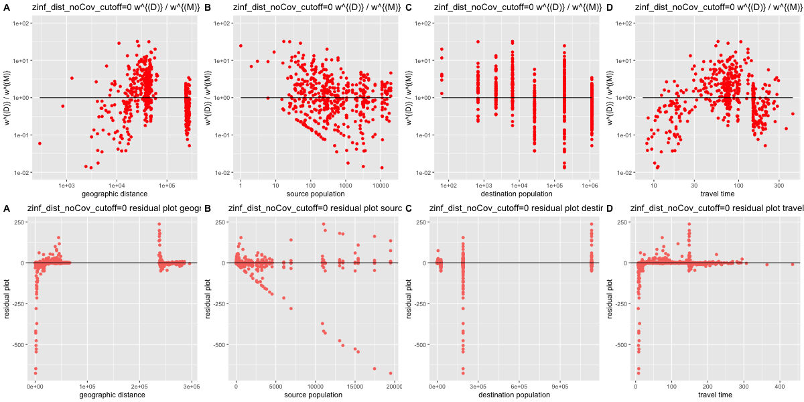

Scripts For Negative Binomial, Zero Inflated Negative Binomial, and
Multinomial Regression On Traveling Model
================
Zhanhao Zhang
7/6/2019

Please add the following features:

  * Add a section explaining, in text or in a bulleted list, all of the different types of models that you are planning on trying.  I know that somewhere here you've tried using a model that incorporates an exponential dependence on distance, but I can't actually find that model anywhere.
  * Relatedly, I'm not sure I believe that adding location covariates to the model makes it perform significantly worse.  This contradicts my own preliminary work on these model fits.  I could be wrong, but it really doesn't make sense to me that knowing which ad2 region someone is traveling from would make the model perform so much worse.  One purpose of this document would be for you to be able to show me how you are transforming your data such that I know how the regression you're performing works, but I can't immediately find in the document where you explain how you're incorporating these locations.  (See next comment.)
  * Whenever you clean a data table for a particular regression model or set of models, explain the features of that data table - that can be as simple as listing the covariate names and what they mean.
  * Please add the Poisson regression to the negative binomial regression - I want to know whether this does significantly worse.
  * You can add to this git repo a folder containing all of the related plots, labelled clearly.
  * Please change the titles of the models in the summary CSV to be consistent with the titles of the models in the document, and with the titles of the models that you plot.  Currently there is no way for me to see which model goes with which part of the summary CSV.
  * I am going to need to actually use your models - they need to be available to me to use.  Ideally, I would like to be able to look at the spreadsheet + plots, identify which specific model I'd like to use, and then get access to that model.  I don't see where I'd be able to do that here.  Here are two suggestions for how to do this (do whichever takes up less memory on disk):
      * Save the cleaned data for each type of model in this git repo, and provide me with clearly documented scripts which let me reproduce the model fit object (which then I can use to pull out coefficients + make predictions)
      * Save a bunch of `lm` objects which I can then read back into `R` to interact with.


## Packages needed

``` r
library(data.table)
library(MASS)
library(ggplot2)
library(reshape2)
library(stringr)
library(pscl)
library(nnet)
library(ggpubr)
```

## Read data

``` r
data <- read.csv("travel_times.csv", header = T)
colnames <- colnames(data)
BI_survey_data <- read.csv("BI_survey_data.csv", header = T)
BI_survey_data <- data.table(BI_survey_data)
```

## Helper functions

Calculate the distance between two coordinates.

``` r
dist <- function(src_cor, dest_cor){
  ###
  # dist() is a function that calculates the geographic distance of a
  # given pair of source and destination locations
  # Inputs:
  #   src_cor: the coordinates of source location
  #   dest_cor: the coordinates of destination location
  # Outputs:
  #   the geographic distance between these two locations
  ###

  return(sqrt((src_cor$X - dest_cor$X)^2 + (src_cor$Y - dest_cor$Y)^2))
}
```

Get the population of a given location

``` r
pop <- function(str){
  ###
  # pop() is a function that gets the population of a given location
  # Inputs:
  #   str: the string indicating the location, which is formatted like
  #        "ti_ban"
  # Outputs
  #   the population of the given location
  ###

  # convert the string format (ex. from "ti_ban" to "Baney")
  # notice that "ti_mal" indicates traveling to Peri or Malabo
  # so for "ti_mal", the str will be converted to
  # a vector ("Peri", "Malabo"), which will be explained in more
  # details in the documentation for cvt()
  str <- cvt(str)

  # if the destination is the mainland of equatorial guinea, then
  # return its population directly
  if(length(str) == 1 && str=="EG_Mainland"){
    return(1129996)
  }

  # if the destination is somewhere in the bioko island, then the
  # population of that location is calculated by summing over
  # population in all areaIds that belong to that location
  res <- c()
  for(s in str){
    res <- c(res, BI_survey_data[ad2==s, pop])
  }

  # if the input str is invalid, then return 0
  if(length(res) == 0){
    return(0)
  }
  return(sum(res))
}
```

Convert the strings that indicate travel destinations in the column
names to the name of that location. For instance, “ti\_ban” to “Baney”.

``` r
cvt <- function(str){
  ###
  # cvt() is a function that converts a string to a more readable format
  # for instance, it will convert "ti_ban" to "Baney"
  # For "ti_mal", since it indicates traveling to Malabo and Peri, this
  # function will convert it to a vector ("Malabo", "Peri")
  # Inputs:
  #   str: the string to be converted, which is formatted as "ti_ban"
  # Outputs:
  #   the more readable version of the string
  #   return NULL for illegal input
  ###

  if(str == "ti_ban"){
    return("Baney")
  } else if(str == "ti_mal"){
    return(c("Malabo", "Peri"))
  } else if(str == "ti_lub"){
    return("Luba")
  } else if(str == "ti_ria"){
    return("Riaba")
  } else if(str == "ti_mok"){
    return("Moka")
  } else if(str == "ti_ure"){
    return("Ureka")
  } else if(str == "to"){
    return("EG_Mainland")
  }
  return(NULL)
}
```

Get the coordinates of a location. The coordinates is looked up from
wikipedia, and the coordinates adopted are at the center of each
location.

_We cannot use Wikipedia as a source for this._

``` r
loc2 <- function(str){
  ###
  # loc2() is a function that returns the coordinates of a given location
  # Inputs:
  #   str: the string that stores the destination location to lookup
  # Outputs:
  #   a list, with X and Y coordinates of the location
  ###

  # convert the input string into a more readable format
  str <- cvt(str)

  if(length(str) == 1 && str == "EG_Mainland"){
    return(list(X = 583415.41, Y = 204498.92))
  }

  # if the input is illegal, return NULL
  if(length(str) == 0){
    return(NULL)
  }

  # if the destinations are Malabo and Peri, return the center
  # of these two locations
  if(length(str) == 2){
    return(list(X = 474872, Y = 414725))
  }
  if(str == "Baney"){
    return(list(X = 490746, Y = 408967))
  } else if(str == "Luba"){
    return(list(X = 450016, Y = 381345))
  } else if(str == "Riaba"){
    return(list(X = 474081, Y = 373967))
  } else if(str == "Moka"){
    return(list(X = 462970, Y = 368444))
  } else if(str == "Ureka"){
    return(list(X = 446303, Y = 361082))
  }
}
```

Get the travel time from a source location (given by areaID) to a
destination location (given by its name). The travel time from Malabo to
the mainland of equatorial guinea is obtained from google map. Notice
that for each offland travels, people have to travel to Malabo first
before they travel offland to the mainland of Equatorial Guinea, so the
travel time from that location to the mainland equals to the time from
Malabo to the mainland (Bata city) plus the travel time from the source
location to Malabo.  
One thing to be aware of is that we have travel time from each areaId to
each areaId, but we only need the travel time from an areaId to one of
the 7 destinations (Baney, Malabo, …), so the travel time is calculated
on the average time of the source areaId to all other areaIds that
belong to the destination.

``` r
tt <- function(id_src, str_dest){
  ###
  # tt() is a function that calculates the travel time between a
  # source location to a destination location
  # Inputs:
  #   id_src: the areaId of the source location
  #   str_dest: the name (formated as "ti_ban") of the
  #             destination location
  # Outputs:
  #   the travel time between these two locations
  #
  # Notice that the only information available to us are the travel time
  # between areaId and areaId, while we need to calculate the travel
  # time between areaId and a location (which contains multiple areaIds).
  # So the travel time is calculated based on the average travel time
  # between the areaId of source location and all other areaIds that
  # belong to the destination location
  ###

  # Conver the name of destination to a more readable version
  str_dest <- cvt(str_dest)

  # If the destination is the mainland of equatorial guinea, then
  # people have to travel from their source location to Malabo first,
  # and then take airplanes from Malabo to the mainland (the Bata City)
  # It takes them 140 minutes to travel from Malabo to the Bata City,
  # which includes the waiting time at the airport
  if(length(str_dest) == 1 && str_dest == "EG_Mainland"){
    return(140 + tt(id_src, "ti_mal"))
  }

  # return NULL for illegal inputs
  if(length(str_dest) == 0){
    return(NULL)
  }

  # Otherwise, of the travel destination is somewhere inside the
  # Bioko island, then return the average travel time between the
  # source areaId to the destination
  sum <- 0
  cnt <- 0
  # The for-loop here is to handle the case where str_dest may be
  # a vector ("Malabo", "Peri")
  for(s in str_dest){
    areaID <- unique(BI_survey_data[ad2==s, areaId])
    cnt <- cnt + length(areaID)
    for(id in areaID){
      t <- data[data$areaId==id_src,][paste("X", id, sep="")]
      t <- t[1,]
      sum <- sum + t
    }
  }
  return(sum / cnt)
}
```

Stores all the travel destinations from the BI\_survey\_data’s column
names.

``` r
centrals <- c("to", "ti_ban", "ti_mal", "ti_lub", "ti_ria",
              "ti_mok", "ti_ure")
```

Fetch the commuting flow from a given areaId to a given destination from
the BI\_survey\_data.

``` r
C <- function(src_id, dest){
  ###
  # C() is a function that gets the commuting flow between the given
  # source and destination
  # Inputs:
  #   src_id: the areaId of the source location
  #   dest: the name of the destination location (formatted as "ti_ban")
  # Outputs:
  #   the commuting flow between these two locations
  ###
  res <- BI_survey_data[areaId==src_id,][[dest]]

  # return 0 if the src_id is not found
  if(length(res) == 0){
    return(0)
  }
  return(res)
}
```

# Negative Binomial Regressions

### The Negative Binomial Regression will be displayed in two parts: ordinary Negative Binomial Regression, and zero inflated Negative Binomial Regression. The cor\_plot\_noBox2() function below is a helper function that can generate correlation plots to visualize either of these models.

A helper function to obtain the correlation plots between the ratio of
true value to fitted value and one of the specified covariates (source
population, destination population, distance, and travel time). If the
true values are 0, then the plots show the relations between the fitted
value to that specified covariate.

_What are `x` and `y`?  What is `exp`?_

``` r
# Correlation plots
cor_plot_single <- function(x, y, res, exp, x_name, y_name, title){
  x <- as.numeric(x)
  y <- as.numeric(y)
  z <- which(y != 0)
  p2 <- ggplot() +
    geom_point(data = NULL,
               aes(x = x[z], y = y[z]), col = "red") +
    ggtitle(paste(title, y_name, "vs", x_name)) +
    xlab(x_name) + ylab(y_name) +
    geom_line(data = NULL, aes(x=x[z], y=exp[z]), col="black") +
    scale_y_log10(limits = c(0.01, 100)) +
    theme(legend.position = "none")
    p2 <- p2 + scale_x_log10()

  p <- ggplot() +
    geom_point(data=NULL,
               aes(x=x, y=res, col="red")) +
    ggtitle(paste(title, "residual plot" , x_name)) +
    xlab(x_name) + ylab("residual plot") +
    geom_hline(yintercept = 0, col="black") +
    theme(legend.position = "none")

  return(list(ratio_plot = p2, residual_plot = p))
}

cor_plot_all <- function(title, dat){
  p1 <- cor_plot_single(dat$d, dat$w / dat$pred, dat$w - dat$pred,
                        rep(1, length(dat$d)), "geographic distance",
                        "w^{(D)} / w^{(M)}", title)
  p2 <- cor_plot_single(dat$N1, dat$w / dat$pred, dat$w - dat$pred,
                        rep(1, length(dat$d)), "source population",
                        "w^{(D)} / w^{(M)}", title)
  p3 <- cor_plot_single(dat$N2, dat$w / dat$pred, dat$w - dat$pred,
                        rep(1, length(dat$d)), "destination population",
                        "w^{(D)} / w^{(M)}", title)
  p4 <- cor_plot_single(dat$t, dat$w / dat$pred, dat$w - dat$pred,
                        rep(1, length(dat$d)), "travel time",
                        "w^{(D)} / w^{(M)}", title)
  g1 <- ggarrange(p1$ratio_plot, p2$ratio_plot, p3$ratio_plot,    
                  p4$ratio_plot, ncol = 4,
                  labels = c("A", "B", "C", "D"))
  g2 <- ggarrange(p1$residual_plot, p2$residual_plot, p3$residual_plot,
                  p4$residual_plot, ncol = 4,
                  labels = c("A", "B", "C", "D"))
  g <- ggarrange(g1, g2, nrow = 2)

  png(filename = paste(title, ".png", sep=""), width = 1200, height = 600)
  print(g)
  dev.off()
}
```

## Negative Binomial Regression and Zero Inflated Negative Binomial Regression Without Additional Covariates

Construct a new dataframe, gravity\_dat, that stores the commuting flow,
source population, destination population, travel time, and geographic
distance between each pair (areaId, destination name).

``` r
gravity_dat <- c()

# The first for-loop iterate through all possible source locations
# which are areaIds in the BI_survey_data
for(i in 1:nrow(BI_survey_data)){
  dat <- BI_survey_data[i]

  # The second for-loop iterate through all possible destinations
  for(dest in centrals){
    w <- C(dat$areaId, dest)
    N1 <- sum(BI_survey_data[areaId==dat$areaId, pop])
    N2 <- pop(dest)
    src_cor <- BI_survey_data[areaId==dat$areaId, .(X, Y)]
    dest_cor <- loc2(dest)
    d <- dist(src_cor, dest_cor)
    if(dest == "to"){
      d <- dist(src_cor, loc2("ti_mal"))
      d <- d + dist(loc2("ti_mal"), dest_cor)
    }
    t <- tt(dat$areaId, dest)
    gravity_dat <- rbind(gravity_dat,
                         list(w = w, N1 = N1, N2 = N2, d = d, t = t))
  }
}
gravity_dat <- data.frame(gravity_dat)
```

Get rid of the last row, which comes from Ureka to Ureka. Ureka has only
one areaId in the BI\_survey\_data, and since the travel time is
calculated based on the average time from the areaId of source location
to all areaIds belong to the destination, we get a 0 for travel time
from Ureka to Ureka. Without moving this row, problems will arise.

``` r
rel_gravity_dat <- gravity_dat[1:1357,]
```

A helper function to generate correlation plots on a given cutoff. The
cutoff can be on geographical distance or on travel time. Also, this
function can be slightly modified to switch between negative binomial
regression and zero inflated negative binomial regression. The return
values of this function include the fitted models and the true values on
both sides of the cutoff.  
One thing to notice is that if the cutoff travel distance is greater
than 60K, I will remove the covariate N2, because beyond that cutoff,
the trips in with higher distance than cutoff only have one destination,
the mainland Equitorial Guinea, and thus the destination population will
always be the same. Without removing this feature, the zero inflated
model will crash.

``` r
plot_cutoff <- function(cutoff, base_dir){
  rel_gravity_dat3 <- rel_gravity_dat[rel_gravity_dat$d > cutoff,]
  rel_gravity_dat4 <- rel_gravity_dat[rel_gravity_dat$d <= cutoff,]

  # Negative Binomial Regression
  dat <- rel_gravity_dat3
  y_nb <- as.numeric(dat[,1])
  N1_nb <- log(as.numeric(dat$N1))
  N2_nb <- log(as.numeric(dat$N2))
  d_nb <- log(as.numeric(dat$d))
  t_nb <- log(as.numeric(dat$t))
  #nb <- glm.nb(y_nb~N1_nb+N2_nb+t_nb)
  nb <- NA
  if(cutoff <= 60000){
    nb <- zeroinfl(y_nb~N1_nb+N2_nb+d_nb, dist="negbin")
  } else{
    nb <- zeroinfl(y_nb~N1_nb+d_nb, dist="negbin")
  }

  if(cutoff <= 0){
    #dir_name <- paste(base_dir, "/no_cutoff", sep = "")
    #dir.create(dir_name)

    dat <- cbind(dat, list(pred=nb$fitted.values))
    for(i in 1:ncol(dat)){
      dat[,i] <- unlist(dat[,i])
    }
    cor_plot_all(paste("zinf_dist_noCov_cutoff=", cutoff, sep=""), dat)

    return(list(nb=nb, nb2=list(fitted.values=0, aic=8, loglik=0), f1=y_nb, f2=0))
    #return(c(8-2*nb$loglik, 8, sum(nb$residuals^2), 0))
  }

  dat2 <- rel_gravity_dat4
  y_nb2 <- as.numeric(dat2[,1])
  N1_nb2 <- log(as.numeric(dat2$N1))
  N2_nb2 <- log(as.numeric(dat2$N2))
  d_nb2 <- as.numeric(dat2$d)
  t_nb2 <- as.numeric(dat2$t)
  #nb2 <- glm.nb(y_nb2~N1_nb2+N2_nb2+t_nb2)
  nb2 <- zeroinfl(y_nb2~N1_nb2+N2_nb2+d_nb2, dist="negbin")

  #dir_name <- paste(base_dir, "/cutoff=", cutoff, sep = "")
  #dir.create(dir_name)

  dat_all <- cbind(rbind(dat, dat2), list(pred=rbind(nb$fitted.values,
                                                     nb2$fitted.values)))
  for(i in 1:ncol(dat_all)){
      dat_all[,i] <- unlist(dat_all[,i])
    }
  cor_plot_all(paste("[model]_noCov_cutoff=", cutoff, sep=""), dat_all)

  return(list(nb=nb, nb2=nb2, f1=y_nb, f2=y_nb2))
  #return(c(nb$aic, nb2$aic, sum(nb$residuals^2), sum(nb2$residuals^2)))
  #return(c(8-nb$loglik, 8-nb2$loglik, sum(nb$residuals^2), sum(nb2$residuals^2)))
}
```

This chunk of code will calculate the AIC and Sum of Residual Square for
each cutoff value of geographic distance or travel time, and then write
the results into a CSV file.

``` r
aics <- c()
cutoffs <- c(0, 10, 20, 30, 40, 50, 60, 100, 150, 200) * 1000
cutoffs_t <- c(0, 50, 100, 150, 200)

base_dir <- "dist_updated/zinf_dist_noCov_zeroincld"

# The for-loop is to iterate through all possible cutoffs for
# geographic distance or for travel times, and then fit the
# models based on the cutoff, generate correlation plots, and
# obtain the AIC and Sum or Residual Squares
for(c in cutoffs){
    res <- plot_cutoff(c, base_dir)
    aic1 <- 8 - 2 * res$nb$loglik
    aic2 <- 8 - 2 * res$nb2$loglik
    ssr1 <- sum((res$nb$fitted.values - res$f1)^2)
    ssr2 <- sum((res$nb2$fitted.values - res$f2)^2)
    aics <- rbind(aics, c(aic1, aic2, ssr1, ssr2))
}

aics

# The "summary" is a matrix that holds the AIC and Sum of residual
# squares information at each cutoff.
summary <- cbind(cutoffs / 1000, aics, aics[,1]+aics[,2] - 8, aics[,3]+aics[,4])
colnames(summary) <- c("Cutoffs", "AIC Far", "AIC Near",
                            "Residual Far", "Residual Near",
                            "AIC Sum", "Residual Sum")
summary
bname <- str_replace_all(base_dir, "/", "_")

# write the summary into a CSV file to store the AIC and SSR results
# of different cutoffs for the model.
write.csv(summary, file=paste(base_dir, "/", bname, "_AIC Summary.csv", sep=""), row.names = F)
```

## Negative Binomial Regression and Zero Inflated Negative Binomial Regression With Additional Covariates (Indicators for Ad2 and travel time or geographic distance between source and Malabo)

Get the relevant data as a dataframe. This is almost identical to the
dataframe for regressions without additional covariates, except that it
includes the indicators and travel time and geographic distance between
source location and Malabo. Again, the last row of the dataframe, which
has a travel time of 0, is removed.

``` r
gravity_dat_covs <- c()
for(i in 1:nrow(BI_survey_data)){
  dat <- BI_survey_data[i]
  for(dest in centrals){
    w <- C(dat$areaId, dest)
    N1 <- sum(BI_survey_data[areaId==dat$areaId, pop])
    N2 <- pop(dest)
    src_cor <- BI_survey_data[areaId==dat$areaId, .(X, Y)]
    dest_cor <- loc2(dest)
    mal_cor <- loc2("ti_mal")
    d <- dist(src_cor, dest_cor)
    if(dest == "to"){
      d <- dist(src_cor, loc2("ti_mal"))
      d <- d + dist(loc2("ti_mal"), dest_cor)
    }
    d2 <- dist(src_cor, mal_cor)
    t <- tt(dat$areaId, dest)
    t2 <- tt(dat$areaId, "ti_mal")

    # create indicators for the ad2
    # ind is initialzed with a list, where each of the 7 locations
    # is mapped to 0
    # Then, query the ad2 from the BI_survey_data. Notice that there
    # is only 1 row for each of the areaId, so by specifying
    # areaId==[the areaId of current data], we are guaranteed to
    # find the row of this data, and thus obtain its ad2
    # Finally, set the ind[ad2] to be 1, so that we have created
    # a list of indicators for each of the 7 locations
    ind <- list(Peri = 0, Malabo = 0, Baney = 0, Luba = 0,
                Riaba = 0, Moka = 0, Ureka = 0)
    ad2 <- unique(BI_survey_data[areaId==dat$areaId, ad2])
    ind[ad2] <- 1

    lst <- list(w = w, N1 = N1, N2 = N2, d = d, d_mal = d2, t=t, t_mal=t2)
    lst <- append(lst, ind)
    gravity_dat_covs <- rbind(gravity_dat_covs, lst)
  }
}
gravity_dat_covs <- data.frame(gravity_dat_covs)
rel_gravity_dat_covs <- gravity_dat_covs[1:1357,]
```

A helper function to plot generate the correlation plots on the given
cutoff. It is almost identical to the plot\_cutoff() function above,
except that it includes additional covariates in its models.

``` r
plot_cutoff_covs <- function(cutoff, base_dir){
  rel_gravity_dat3 <- rel_gravity_dat_covs[rel_gravity_dat_covs$d > cutoff,]
  rel_gravity_dat4 <- rel_gravity_dat_covs[rel_gravity_dat_covs$d <= cutoff,]

  # Negative Binomial Regression
  dat <- rel_gravity_dat3
  y_nb <- as.numeric(dat[,1])
  N1_nb <- log(as.numeric(dat$N1))
  N2_nb <- log(as.numeric(dat$N2))
  d_nb <- log(as.numeric(dat$d))
  d2_nb <- as.numeric(dat$d_mal)
  t_nb <- log(as.numeric(dat$t))
  t2_nb <- as.numeric(dat$t_mal)
  peri_nb <- as.numeric(dat$Peri)
  malabo_nb <- as.numeric(dat$Malabo)
  baney_nb <- as.numeric(dat$Baney)
  luba_nb <- as.numeric(dat$Luba)
  riaba_nb <- as.numeric(dat$Riaba)
  moka_nb <- as.numeric(dat$Moka)
  ureka_nb <- as.numeric(dat$Ureka)
  #nb <- glm.nb(y_nb~N1_nb+N2_nb+d_nb+d2_nb+peri_nb+malabo_nb+
   #              baney_nb+luba_nb+riaba_nb+moka_nb+ureka_nb)

  nb <- NA
  if(cutoff <= 60000){
    nb <- zeroinfl(y_nb~N1_nb+N2_nb+d_nb+d2_nb + peri_nb+malabo_nb+
                 baney_nb+luba_nb+riaba_nb+moka_nb, dist="negbin")
  } else{
    nb <- zeroinfl(y_nb~N1_nb+d_nb+d2_nb + peri_nb+malabo_nb+
                     baney_nb+luba_nb+riaba_nb+moka_nb, dist="negbin")
  }

  if(cutoff <= 0){
    dir_name <- paste(base_dir, "/no_cutoff", sep = "")
    dir.create(dir_name)

    dat <- cbind(dat, list(pred=nb$fitted.values))
    for(i in 1:ncol(dat)){
      dat[,i] <- unlist(dat[,i])
    }
    cor_plot_all(paste("[model]_cov_cutoff=", cutoff, sep=""), dat)

    return(list(nb=nb, nb2=list(fitted.values=0, aic=24, loglik=0), f1=y_nb, f2=0))
    #return(c(nb$aic, 0, sum(nb$residuals^2), 0))
    #return(c(24-nb$loglik, 0, sum(nb$residuals^2), 0))
  }

  dat2 <- rel_gravity_dat4
  y_nb2 <- as.numeric(dat2[,1])
  N1_nb2 <- log(as.numeric(dat2$N1))
  N2_nb2 <- log(as.numeric(dat2$N2))
  d_nb2 <- as.numeric(dat2$d)
  d2_nb2 <- as.numeric(dat2$d_mal)
  t_nb2 <- as.numeric(dat2$t)
  t2_nb2 <- as.numeric(dat2$t_mal)
  peri_nb2 <- as.numeric(dat2$Peri)
  malabo_nb2 <- as.numeric(dat2$Malabo)
  baney_nb2 <- as.numeric(dat2$Baney)
  luba_nb2 <- as.numeric(dat2$Luba)
  riaba_nb2 <- as.numeric(dat2$Riaba)
  moka_nb2 <- as.numeric(dat2$Moka)
  ureka_nb2 <- as.numeric(dat2$Ureka)
  #nb2 <- glm.nb(y_nb2~N1_nb2+N2_nb2+d_nb2+d2_nb2+peri_nb2+malabo_nb2+
   #              baney_nb2+luba_nb2+riaba_nb2+moka_nb2+ureka_nb2)

  nb2 <- zeroinfl(y_nb2~N1_nb2+N2_nb2+d_nb2+d2_nb2+peri_nb2+malabo_nb2+
                 baney_nb2+luba_nb2+riaba_nb2+moka_nb2, dist="negbin")

  dir_name <- paste(base_dir, "/cutoff=", cutoff, sep = "")
  dir.create(dir_name)

  dat_all <- cbind(rbind(dat, dat2), list(pred=rbind(nb$fitted.values,
                                                     nb2$fitted.values)))
  for(i in 1:ncol(dat_all)){
      dat_all[,i] <- unlist(dat_all[,i])
    }
  cor_plot_all(paste("[model]_cov_cutoff=", cutoff, sep=""), dat_all)

  return(list(nb=nb, nb2=nb2, f1=y_nb, f2=y_nb2))
  #return(c(nb$aic, nb2$aic, sum(nb$residuals^2), sum(nb2$residuals^2)))
  #return(c(24-nb$loglik, 24-nb2$loglik, sum(nb$residuals^2), sum(nb2$residuals^2)))
}
```

Plot the correlation plots at each cutoff, and calculate AIC and sum of
residual squares for each case. This is the same as the one for negative
binomial regression/zero inflated negative binomial regression without
additional covariates above, except that for the calculation of AIC, its
constant is 24 instead of 8, since we have 12 covariates instead of 4.

``` r
aics <- c()
cutoffs <- c(0, 10, 20, 30, 40, 50, 60, 100, 150, 200, 220, 240) * 1000
cutoffs_t <- c(0, 50, 100, 150, 200)

base_dir <- "dist_updated/zinf_dist_cov_zeroincld"

for(c in cutoffs){
  #tryCatch({
  res <- plot_cutoff_covs(c, base_dir)
  aic1 <- 24 - res$nb$loglik
  aic2 <- 24 - res$nb2$loglik
  ssr1 <- sum((res$nb$fitted.values - res$f1)^2)
  ssr2 <- sum((res$nb2$fitted.values - res$f2)^2)
  aics <- rbind(aics, c(aic1, aic2, ssr1, ssr2))
  #}, error = function(e){})
}

nb_mul_cov <- plot_mul_cov("multinom/time_cov")
nb_mul_cov$AIC
sum(nb_mul_cov$residuals^2)

aics
aics_summary <- cbind(cutoffs / 1000, aics, aics[,1]+aics[,2]-24, aics[,3]+aics[,4])
colnames(aics_summary) <- c("Cutoffs", "AIC Far", "AIC Near",
                            "Residual Far", "Residual Near",
                            "AIC Sum", "Residual Sum")

bname <- str_replace_all(base_dir, "/", "_")
write.csv(aics_summary, file=paste(base_dir, "/", bname, "_AIC Summary.csv", sep=""), row.names = F)
```

# Multinomial Regression

_What's different for how you need to prepare the data for multinomial regression compared to the other regressions?_

Prepare the relevant data and true values as dataframes for multinomial
regression.  
rel\_dat\_mul is used for training the multinomial regression model. For
each pair of locations (areaId for source, name of destination), it the
commuting flow w is greater than 0, then the same pair will repeat for w
times. The levels of multinomial regression are the 7 different
destinations.  
test\_dat\_mul stores the dataframe without repeating these pairs. It is
used for getting the predicted values comparable to the true values.

``` r
rel_dat_mul <- c()
test_dat_mul <- c()
for(i in 1:nrow(BI_survey_data)){
  row <- BI_survey_data[i,]
  ind <- list(Peri = 0, Malabo = 0, Baney = 0, Luba = 0,
              Riaba = 0, Moka = 0, Ureka = 0)
  ad2 <- row$ad2
  ind[ad2] <- 1
  N1 <- row$pop
  w_total <- sum(row[,19:25])
  lst <- append(list(N1=N1, w_total = w_total), ind)
  all_t <- list(t.ti_mal = 0, t.ti_ban = 0, t.ti_lub = 0,
                t.ti_ria = 0, t.ti_mok = 0, t.ti_ure = 0, t.to = 0)
  all_N2 <- list(N2.ti_mal = 0, N2.ti_ban = 0, N2.ti_lub = 0,
                 N2.ti_ria = 0, N2.ti_mok = 0, N2.ti_ure = 0, N2.to = 0)
  for(d in centrals){
    t <- tt(row$areaId, d)
    all_t[paste("t.", d, sep="")] <- t
    N2 <- pop(d)
    all_N2[paste("N2.", d, sep="")] <- N2
  }

  lst <- append(lst, all_N2)
  lst <- append(lst, all_t)

  src_cor <- BI_survey_data[areaId==row$areaId, .(X, Y)]
  dest_cor <- loc2(dest)
  mal_cor <- loc2("ti_mal")
  t2 <- tt(row$areaId, "ti_mal")

  lst <- append(lst, list(t_mal=t2))

  for(dest in centrals){
    w <- row[[dest]]
    if(w > 0){
      for(j in 1:w){
        temp <- append(lst, list(dest=dest))
        rel_dat_mul <- rbind(rel_dat_mul, temp)
      }
    }
  }

  test_dat_mul <- rbind(test_dat_mul, lst)
}
rel_dat_mul <- data.frame(rel_dat_mul, row.names = NULL)
test_dat_mul <- data.frame(test_dat_mul, row.names = NULL)

# unlist each column, so that they are easier for computations
for(i in 1:ncol(rel_dat_mul)){
  rel_dat_mul[,i] <- unlist(rel_dat_mul[,i])
}
for(i in 1:ncol(test_dat_mul)){
  test_dat_mul[,i] <- unlist(test_dat_mul[,i])
}
```

Train the multinomial regression model, and transform the predicted
values into a format that is comparable with the true values in the
dataset. Then, get the sum of residual squares.

``` r
mul_reg <- multinom(dest~., maxit=5000, data = rel_dat_mul)
pred_mul <- predict(mul_reg, test_dat_mul, "probs")
for(i in 1:ncol(pred_mul)){
  pred_mul[,i] <- pred_mul[,i] * test_dat_mul$w_total
}

sub <- data.frame(BI_survey_data[,19:25])
sub <- sub[,as.numeric(order(colnames(sub)))]

sum((pred_mul - sub)^2)
```

The helper function for obtaining correlation plots on the multinomial
regression
model.

``` r
mul_plot_noBox2 <- function(inv, name, log, pred, classification, dir, orig){
  inv <- as.numeric(inv)
  dv <- orig / pred
  z <- which(dv != 0)
  p2 <- ggplot() +
    geom_point(data = NULL,
               aes(x = inv[z], y = dv[z]), col = "red") +
    ggtitle(paste(dir, "w^(D) / w^(M) vs", name)) +
    xlab(name) + ylab("w^(D) / w^(M)") +
    geom_hline(yintercept = 1, col="black") +
    scale_y_log10(limits = c(0.01, 100))
  if(log){
    p2 <- p2 + scale_x_log10()
  }
  png(paste(dir, "/", name, "_", classification, ".png", sep = ""))
  print(p2)
  dev.off()

  z2 <- which(dv == 0)
  p <- ggplot() +
    geom_point(data=NULL,
               aes(x=inv[z2], y=pred[z2], col="red")) +
    ggtitle(paste(dir, "w^(M) vs", name)) +
    xlab(name) + ylab("w^(M)") +
    geom_hline(yintercept = 0, col="black")
  if(log){
    p <- p + scale_x_log10()
  }

  png(paste(dir, "/", name, "_", classification, "_zero.png", sep = ""))
  print(p)
  dev.off()
}
```

Get the original values, predicted values and data with the format that
can easily obtain correlation plots.  
And, plot these correlation plots.

``` r
dat <- c()
pred_mul_rs <- c()
orig <- c()
for(i in 1:nrow(test_dat_mul)){
  row <- test_dat_mul[i,]
  N1 <- row$N1

  j <- 1
  for(d in sort(centrals)){
    N2 <- row[[paste("N2.", d, sep="")]]
    t <- row[[paste("t.", d, sep="")]]

    pred_mul_rs <- c(pred_mul_rs, pred_mul[i, j])
    orig <- c(orig, sub[i, j])

    src_cor <- BI_survey_data[areaId==BI_survey_data[i,]$areaId, .(X, Y)]
    dest_cor <- loc2(d)
    dst <- dist(src_cor, dest_cor)
    if(d == "to"){
      dst <- dist(src_cor, loc2("ti_mal"))
      dst <- dst + dist(loc2("ti_mal"), dest_cor)
    }

    dat <- rbind(dat, list(N1=N1,N2=N2,t=t, d=dst))

    j <- j + 1
  }
}
dat <- data.frame(dat)
base_dir <- "dist_updated"

dir_name <- paste(base_dir, "/multinomial2", sep = "")
dir.create(dir_name)

dat <- cbind(dat, list(w=orig, pred=pred_mul_rs))
cor_plot_all("multinom", dat)
```

# Results

_What metrics are you using to determine best/worst results?_

_The x-axes are different between the top and bottom rows, making it hard to compare the top to the bottom rows.  Can you change the titles of the plots to be more readable - you're using a code to describe these plots which I don't necessarily understand._

So far, we have tried out Negative Binomial Regression, Zero Inflated
Negative Binomial Regression, and Multinomial Regression. To evaluate
their performance, I plotted ratio plots (data / fitted.values) and
residual plots (data - fitted.values) for each of the covariate for each
model. The plots for the best model (multinomial regression), and the
worst model (negative binomial using geographic distance with no cutoff
on distance) are shown
below:

### Multinomial Regression Performance Plots


### Zero Inflated Negative Binomial Regression Performance Plots



_Please explain the columns in this CSV file.  I do not know what these different grouped tables are or mean, or which models they correspond to.  I see that there's a label "ExpPow," which appears no where in this document.  Also, explain what the units for "cutoffs" are._

_Please explain the gaps in this CSV file, what the errors are and where they come from_

_Why is there only one AIC value for the multinomial regression?  You're fitting only one model here?_

_I've brought this up a few times before: what is happening when you're using 240 as your cutoff?  Why is it that the AIC goes up while the residual sum goes down?  What's going on?_


To see a complete summary of AIC and Sum of Residual Squares of each
model at each cutoff, view the [summary.csv](./summary.csv)
